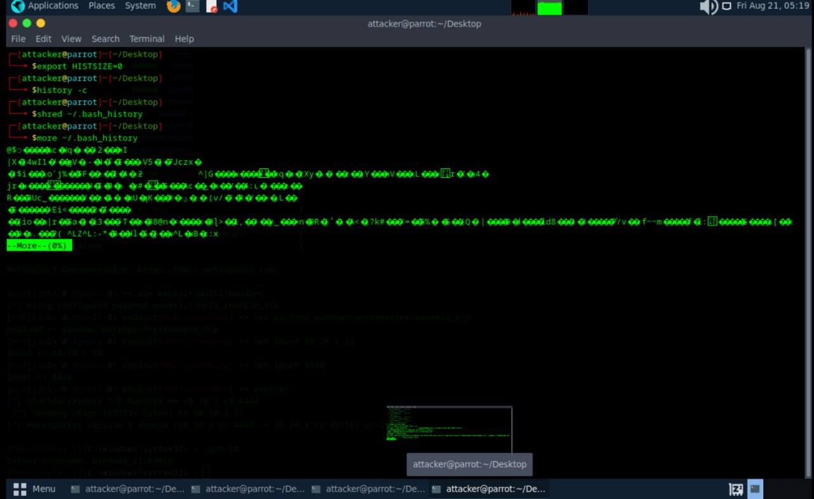
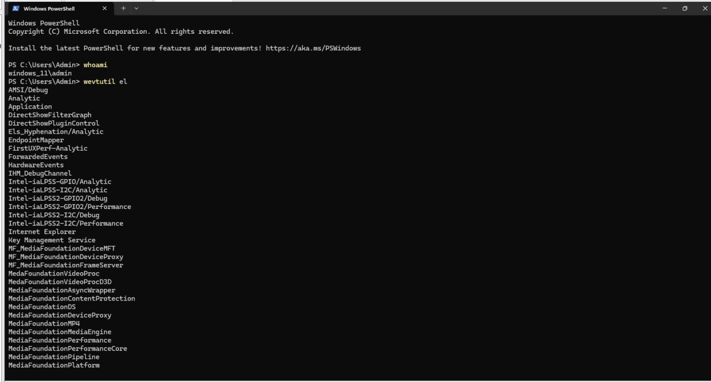
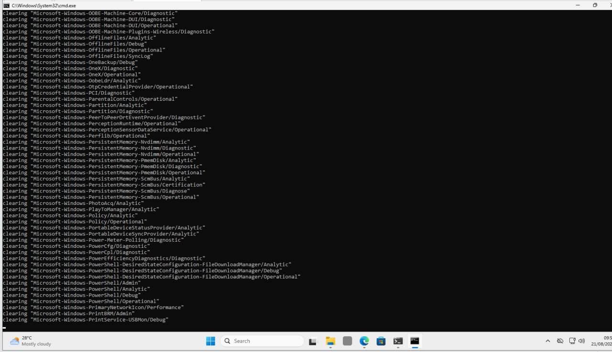
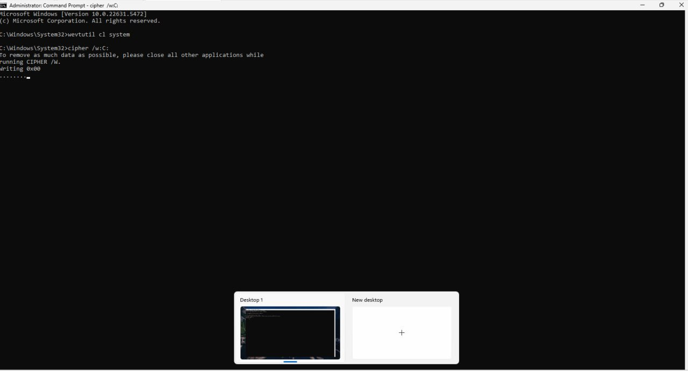

# Covering Tracks Lab

Date: 2026-08-21
Attacker Machine: Parrot OS (10.10.1.13)
Target: Windows 11 (10.10.1.11)
Tools: Bash, wevtutil, cipher
Environment: VMware isolated lab network

---

## Objective
After gaining access to a Windows 11 target, cover all
tracks by clearing logs and wiping evidence on both the
attacker machine and the target to avoid detection and
forensic investigation.

---

## What is Covering Tracks?
Covering tracks is the final phase of the ethical hacking
methodology. After a successful attack, an attacker removes
evidence of their presence to avoid detection by system
administrators, security tools, and forensic investigators.

This includes:
- Clearing command history on the attacker machine
- Clearing Windows event logs on the target
- Wiping free disk space to remove file remnants
- Removing any files or tools left on the target

---

## Step 1 — Clear Bash History on Attacker Machine

Command history was cleared on the Parrot OS attacker
machine to remove any trace of commands run during
the attack.

    export HISTSIZE=0
    history -c
    shred ~/.bash_history
    more ~/.bash_history

shred overwrites the bash history file multiple times
making it unrecoverable even with forensic tools.
The more command confirmed the file contents were
destroyed showing only garbled data.

---

## Step 2 — List All Event Logs on Target

On the Windows 11 target, PowerShell was used to
confirm identity and list all available event logs
before clearing them.

    whoami
    windows_11\admin

    wevtutil el

This returned a full list of all Windows event log
channels including Application, Security, System,
PowerShell, and hundreds of Microsoft service logs.

---

## Step 3 — Clear All Windows Event Logs

All Windows event logs were cleared using wevtutil
from an elevated Command Prompt on the target machine.
Hundreds of log channels were wiped including Security,
Application and all Microsoft Windows service logs.

    for /F "tokens=*" %1 in ('wevtutil el') do wevtutil cl "%1"

Every log channel returned the status clearing
confirming successful deletion of all event records.

---

## Step 4 — Clear System Log and Wipe Free Space

The System event log was cleared individually and
cipher was used to overwrite all free disk space on
the C drive to prevent file recovery tools from
recovering deleted files or artifacts.

    wevtutil cl system

    cipher /w:C:

    To remove as much data as possible, please close
    all other applications while running CIPHER /W.
    Writing 0x00
    ..........

cipher /w overwrites free space with zeros, then
random data, making forensic file recovery impossible.

---

## Attack Summary

| Step | Action | Result |
|------|--------|--------|
| 1 | Bash history cleared on Parrot | No command trace remains |
| 2 | Event logs listed on target | All log channels identified |
| 3 | All Windows logs cleared | Hundreds of channels wiped |
| 4 | System log cleared | Security events removed |
| 5 | cipher /w:C: run | Free space overwritten |

---

## Critical Findings

| Finding | Detail | Impact |
|---------|--------|--------|
| Bash history destroyed | shred used on attacker | HIGH |
| All Windows logs wiped | No audit trail remains | CRITICAL |
| System log cleared | Attack evidence removed | CRITICAL |
| Free space overwritten | File recovery impossible | HIGH |

---

## What Was Removed

On the attacker machine:
- All bash command history
- Evidence of MSFVenom commands
- Evidence of Metasploit sessions
- Evidence of Responder usage
On the Windows target:
- Security event logs
- Application event logs
- System event logs
- All Microsoft Windows service logs
- Deleted file remnants on C drive

---

## Lessons Learned

1. shred is more effective than rm or delete as it
   overwrites data multiple times
2. wevtutil can clear all Windows event logs in
   seconds from a single command
3. cipher /w makes file recovery forensically
   impossible on NTFS volumes
4. Clearing tracks is most effective when done
   immediately after the attack
5. Even with logs cleared, network traffic logs
   on routers and firewalls may still contain evidence

---

## Defensive Recommendations

- Forward logs to a remote SIEM in real time so
  local log deletion does not destroy all evidence
- Alert on wevtutil cl commands being executed
- Monitor for cipher /w usage outside maintenance
- Restrict access to wevtutil on non-admin accounts
- Enable Windows Event Forwarding to a central server
- Monitor bash history file modifications on Linux
- Use immutable logging solutions where possible

---

## Tools Used
- Bash (shred, history)
- wevtutil (Windows Event Utility)
- cipher (Windows disk wipe utility)
- Parrot Security OS
- Windows 11 Command Prompt

---

## Next Steps
- Verify no logs remain on target
- Check network devices for traffic logs
- Remove any remaining tools or payloads
- Confirm attacker machine shows no activity traces
