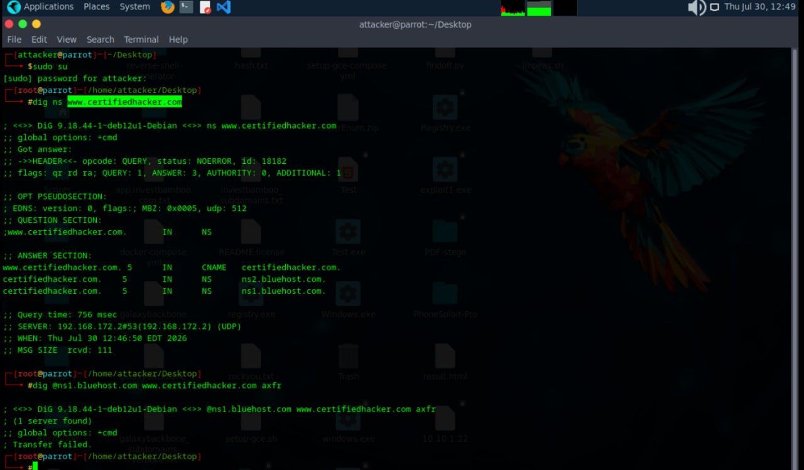

# DNS Enumeration Lab

Date: 2026-07-30
Attacker Machine: Parrot OS
Target: www.certifiedhacker.com
Tool: dig (Domain Information Groper)
Environment: Live internet target

---

## Objective
Perform DNS enumeration against a target domain
to discover nameservers, mail servers, subdomains
and attempt zone transfer to extract complete
DNS records.

---

## What is DNS Enumeration?
DNS (Domain Name System) enumeration involves
querying DNS servers to extract information about
a target domain including:
- Nameserver records (NS)
- Mail server records (MX)
- IP addresses (A records)
- Aliases (CNAME records)
- Zone transfer attempts (AXFR)

---

## Scan 1 — Nameserver Enumeration

dig ns www.certifiedhacker.com

### Results
QUESTION SECTION:
www.certifiedhacker.com    IN    NS

ANSWER SECTION:
www.certifiedhacker.com  5  IN  CNAME  certifiedhacker.com
certifiedhacker.com      5  IN  NS     ns2.bluehost.com
certifiedhacker.com      5  IN  NS     ns1.bluehost.com

Query time: 756 msec
SERVER: 192.168.172.2#53 (UDP)
WHEN: Thu Jul 30 12:46:50 EDT 2026
MSG SIZE rcvd: 111

### What This Reveals
- Domain is hosted on Bluehost
- Two nameservers identified: ns1 and ns2
- CNAME record shows www redirects to root domain
- Nameservers can be targeted for zone transfer

---

## Scan 2 — Zone Transfer Attempt

dig @ns1.bluehost.com www.certifiedhacker.com axfr

### Results
1 server found
Transfer failed.

### What This Reveals
Zone transfer was blocked by ns1.bluehost.com
This is the correct security configuration.
If zone transfer had succeeded it would have
revealed ALL DNS records for the domain including
internal hostnames and IP addresses.

---

## Critical Findings Summary

| Finding | Detail | Risk |
|---------|--------|------|
| Nameservers identified | ns1 and ns2.bluehost.com | MEDIUM |
| Hosting provider revealed | Bluehost | LOW |
| CNAME record exposed | www → certifiedhacker.com | LOW |
| Zone transfer blocked | Transfer failed | POSITIVE |

---

## What Zone Transfer Would Have Revealed
If AXFR had succeeded attacker would get:
- All subdomains (mail, ftp, admin, vpn etc)
- Internal IP addresses
- Complete network map of domain
- Hidden services and applications

---

## Lessons Learned

1. DNS enumeration reveals hosting infrastructure
   without any authentication
2. Zone transfers should always be restricted
   to authorised secondary nameservers only
3. Nameserver identification enables targeted
   attacks against DNS infrastructure
4. CNAME records reveal domain relationships
   and potential redirect chains

---

## Defensive Recommendations

- Restrict zone transfers to authorised IPs only
- Disable AXFR on public nameservers
- Use split-horizon DNS to hide internal records
- Monitor DNS queries for enumeration patterns
- Implement DNSSEC for record integrity

---

## Tools Used
- dig (Domain Information Groper)
- Parrot Security OS

---

## Next Steps
- Enumerate subdomains using tools like
  Sublist3r or theHarvester
- Query MX records for mail server info
- Attempt reverse DNS lookups
- Use dnsenum for automated enumeration

