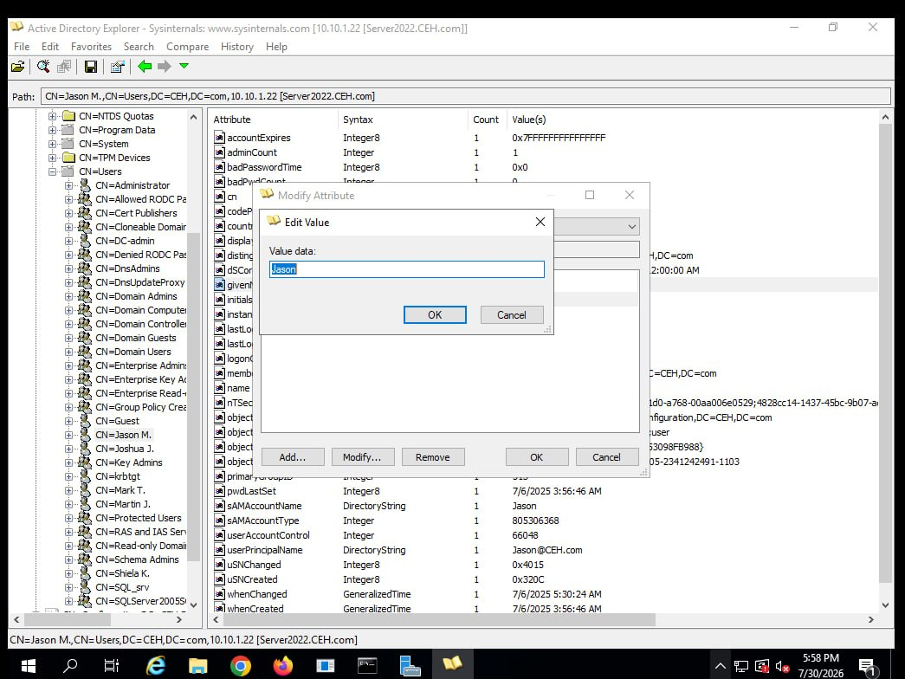
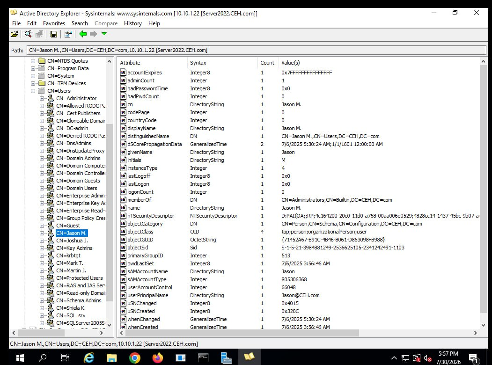
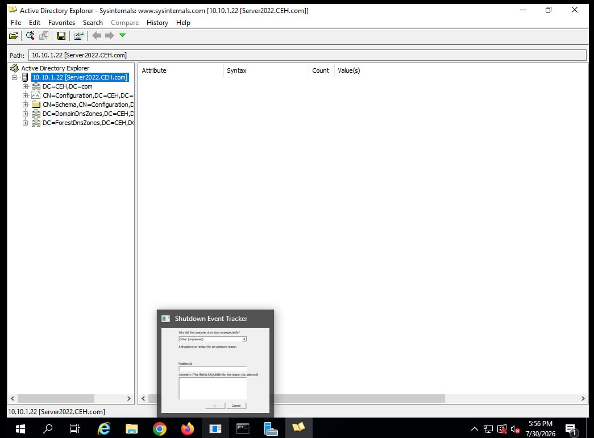

# LDAP Enumeration Lab

Date: 2026-07-30
Attacker Machine: Windows Server 2022
Target: 10.10.1.22 (Server2022.CEH.com)
Tool: Active Directory Explorer (Sysinternals)
Domain: CEH.com
Environment: VMware isolated lab network

---

## Objective
Enumerate LDAP directory services on a Windows
Active Directory Domain Controller to extract
user accounts, group memberships, and sensitive
account attributes without exploitation.

---

## What is LDAP Enumeration?
LDAP (Lightweight Directory Access Protocol)
runs on port 389 and is used by Active Directory
to store and retrieve directory information.
Enumeration can reveal:
- All domain user accounts
- Group memberships
- Password policies
- Account attributes
- Organisational structure

---

## Tool Used — Active Directory Explorer

AD Explorer by Sysinternals is a powerful LDAP
browser that allows viewing and editing of
Active Directory databases. It connects directly
to a domain controller and displays the complete
directory structure.

---

## Step 1 — Connect to Domain Controller

Connected to: 10.10.1.22 [Server2022.CEH.com]

Directory structure discovered:
- DC=CEH,DC=com
- CN=Configuration,DC=CEH,DC=com
- CN=Schema,CN=Configuration,DC=CEH,DC=com
- DC=DomainDnsZones,DC=CEH,DC=com
- DC=ForestDnsZones,DC=CEH,DC=com

---

## Step 2 — User Enumeration

Navigated to: CN=Users,DC=CEH,DC=com

### Domain Users Discovered

- CN=Administrator
- CN=Allowed RODC Pa
- CN=Cert Publishers
- CN=Cloneable Domain
- CN=DC-admin
- CN=Denied RODC Pa
- CN=DnsAdmins
- CN=DnsUpdateProxy
- CN=Domain Admins
- CN=Domain Computers
- CN=Domain Controller
- CN=Domain Guests
- CN=Domain Users
- CN=Enterprise Admins
- CN=Enterprise Key Ac
- CN=Enterprise Read-only
- CN=Group Policy Creator
- CN=Guest
- CN=Jason M.
- CN=Joshua J.
- CN=Key Admins
- CN=krbtgt
- CN=Mark T.
- CN=Martin J.
- CN=Protected Users
- CN=RAS and IAS Servers
- CN=Read-only Domain
- CN=Schema Admins
- CN=Shiela K.
- CN=SQL_srv
- CN=SQLServer2005S

---

## Step 3 — Detailed User Attribute Extraction

Selected user: CN=Jason M.

### Jason M. Full Attributes

| Attribute | Value |
|-----------|-------|
| cn | Jason M. |
| displayName | Jason M. |
| givenName | Jason |
| initials | M |
| userPrincipalName | Jason@CEH.com |
| sAMAccountName | Jason |
| memberOf | CN=Administrators,CN=Builtin,DC=CEH,DC=com |
| adminCount | 1 |
| objectGUID | {71452A67-B91C-4B46-8061-D853098FB988} |
| objectSid | S-1-5-21-3984881249-2536625105-2341242491-1103 |
| pwdLastSet | 7/6/2025 3:56:46 AM |
| whenCreated | 7/6/2025 3:56:46 AM |
| accountExpires | 0x7FFFFFFFFFFFFFFF (Never) |
| badPasswordTime | 0x0 |
| logonCount | 0 |

### Critical Findings
adminCount = 1 confirms Jason M. is a
privileged administrator account!

memberOf = CN=Administrators confirms
Jason M. is in the Administrators group!

---

## Critical Findings Summary

| Finding | Detail | Risk |
|---------|--------|------|
| 20+ domain accounts enumerated | Full user list extracted | CRITICAL |
| Admin account identified | Jason M. adminCount=1 | CRITICAL |
| Email address exposed | Jason@CEH.com | HIGH |
| Account SID exposed | Full SID visible | HIGH |
| krbtgt account visible | Kerberoasting target | CRITICAL |
| SQL service account | CN=SQL_srv visible | HIGH |
| Password last set exposed | 7/6/2025 | MEDIUM |

---

## Attack Scenarios

### Scenario 1 — Password Spraying
All discovered usernames can be targeted
with password spraying attacks:
- Jason, Administrator, DC-admin
- SQL_srv service account attacks

### Scenario 2 — Kerberoasting
krbtgt and SQL_srv accounts are prime
targets for Kerberoasting attacks to
extract and crack service ticket hashes.

### Scenario 3 — Targeted Phishing
Real email Jason@CEH.com can be used
for spear phishing attacks targeting
a known administrator.

---

## Lessons Learned
1. LDAP exposes the entire Active Directory
   structure without exploitation
2. Admin accounts identified by checking
   adminCount attribute value
3. Service accounts like SQL_srv are high
   value targets for privilege escalation
4. krbtgt account exposure enables
   Golden Ticket attack planning
5. Always restrict LDAP access to
   authorised systems only

---

## Defensive Recommendations

- Restrict LDAP access to authorised hosts
- Implement LDAP signing and channel binding
- Enable audit logging for LDAP queries
- Use tiered administration model
- Remove unnecessary admin accounts
- Regularly audit group memberships
- Implement Just-In-Time access

---

## Tools Used
- Active Directory Explorer (Sysinternals)
- Windows Server 2022

---

## Next Steps
- Attempt Kerberoasting against SQL_srv
- Password spray discovered usernames
- Enumerate group policies
- Run BloodHound for attack path analysis
