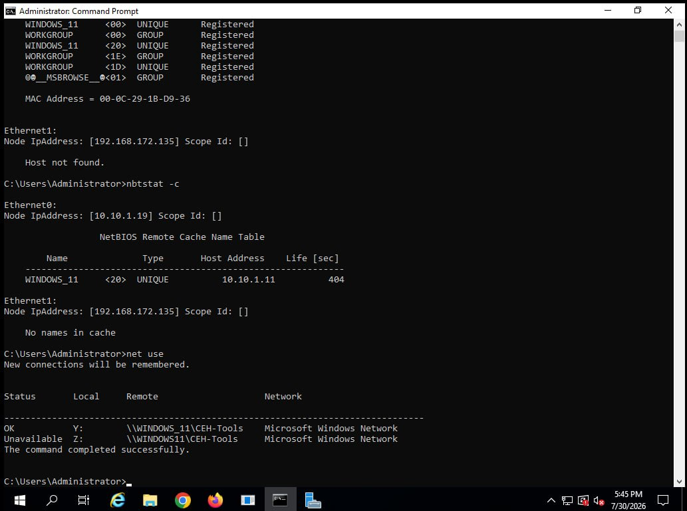
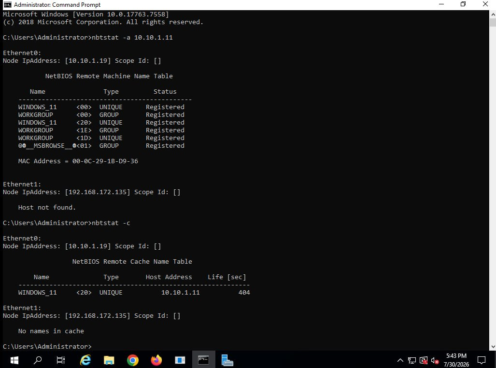

# NetBIOS Enumeration Lab

Date: 2026-07-30
Attacker Machine: Windows Server 2019
Target: 10.10.1.11 (WINDOWS_11)
Tools: nbtstat, net use
Environment: VMware isolated lab network

---

## Objective
Enumerate NetBIOS information from a target Windows
machine to discover hostnames, workgroup membership,
MAC addresses, and shared network resources.

---

## What is NetBIOS?
NetBIOS (Network Basic Input/Output System) is a legacy
Windows networking protocol that allows applications to
communicate over a local network. It exposes valuable
information during reconnaissance including:
- Computer names
- Workgroup/domain names
- MAC addresses
- Shared resources
- Logged on users

---

## Command 1 — Remote NetBIOS Name Table

nbtstat -a 10.10.1.11

### Results
Node IpAddress: [10.10.1.19]

NetBIOS Remote Machine Name Table:

Name             Type    Status
WINDOWS_11      <00>    UNIQUE    Registered
WORKGROUP       <00>    GROUP     Registered
WINDOWS_11      <20>    UNIQUE    Registered
WORKGROUP       <1E>    GROUP     Registered
WORKGROUP       <1D>    UNIQUE    Registered
@@MSBROWSE@  <01>   GROUP     Registered

MAC Address = 00-0C-29-1B-D9-36

### What This Reveals
- Computer name: WINDOWS_11
- Workgroup: WORKGROUP
- MAC Address: 00-0C-29-1B-D9-36 (VMware NIC)
- <20> entry confirms FILE SHARING is enabled
- @@MSBROWSE confirms this machine is the
  local master browser on the network

---

## Command 2 — NetBIOS Cache Table

nbtstat -c

### Results
NetBIOS Remote Cache Name Table:

Name        Type    Host Address    Life [sec]
WINDOWS_11  <20>    10.10.1.11      404

### What This Reveals
- WINDOWS_11 is cached with file sharing active
- Cache lifetime: 404 seconds
- Confirms active communication with target

---

## Command 3 — Network Share Enumeration

net use

### Results
Status      Local   Remote                      Network
OK          Y:      \\WINDOWS_11\CEH-Tools      Microsoft Windows Network
Unavailable Z:      \\WINDOWS11\CEH-Tools       Microsoft Windows Network

### What This Reveals
- Drive Y: successfully mapped to CEH-Tools share
- Drive Z: unavailable — possible hostname
  mismatch (WINDOWS11 vs WINDOWS_11)
- CEH-Tools share contains penetration testing
  tools accessible over the network

---

## Key Findings Summary

| Finding | Detail | Risk |
|---------|--------|------|
| File sharing enabled | Port 139/445 open | HIGH |
| Network share exposed | CEH-Tools accessible | HIGH |
| Computer name revealed | WINDOWS_11 | MEDIUM |
| MAC address exposed | 00-0C-29-1B-D9-36 | LOW |
| Master browser identified | WORKGROUP network | LOW |

---

## NetBIOS Name Codes Reference

| Code | Type | Meaning |
|------|------|---------|
| <00> | UNIQUE | Workstation service |
| <00> | GROUP | Workgroup name |
| <20> | UNIQUE | File server service |
| <1E> | GROUP | Browser elections |
| <1D> | UNIQUE | Master browser |

---

## Lessons Learned

1. NetBIOS exposes critical network information
   without any authentication required
2. File sharing enabled (<20>) means the target
   is accessible via SMB
3. Network shares can contain sensitive tools
   and data accessible to any network user
4. Master browser role reveals network topology
5. Always disable NetBIOS over TCP/IP in
   production environments if not needed

---

## Defensive Recommendations

- Disable NetBIOS over TCP/IP if not required
- Restrict SMB access to authorised hosts only
- Audit and restrict network share permissions
- Block ports 137, 138, 139 at the firewall
- Monitor for unauthorised NetBIOS queries

---

## Tools Used
- nbtstat (Windows built-in)
- net use (Windows built-in)
- Windows Server 2019 Command Prompt

---

## Next Steps
- Enumerate SNMP on same targets
- Run enum4linux for deeper SMB enumeration
- Attempt to access CEH-Tools share contents
