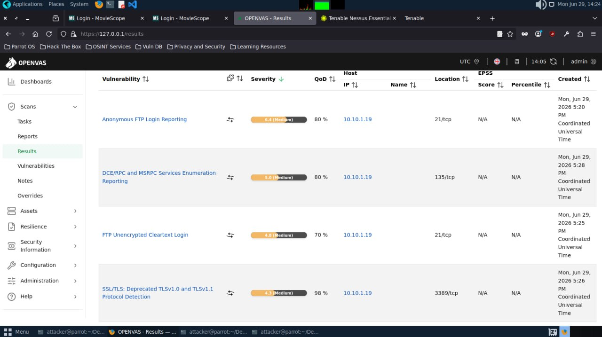
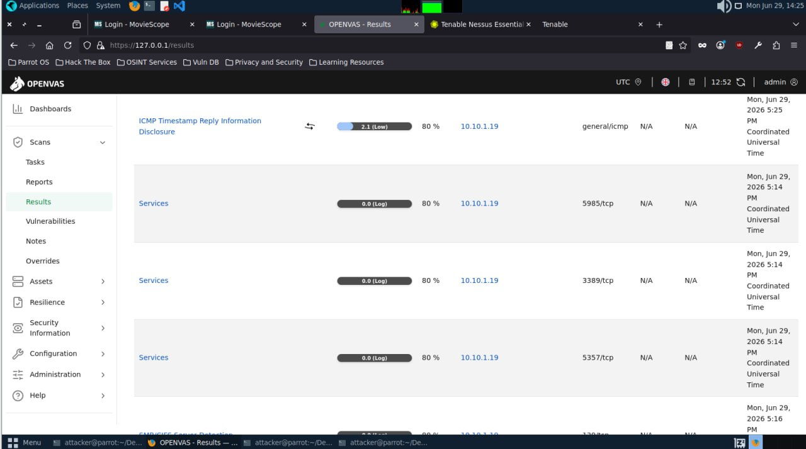
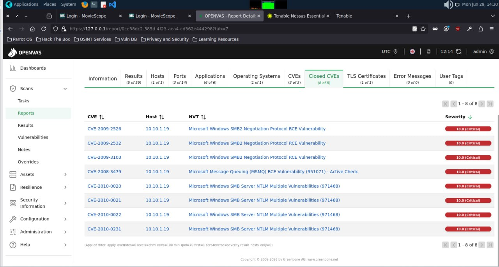
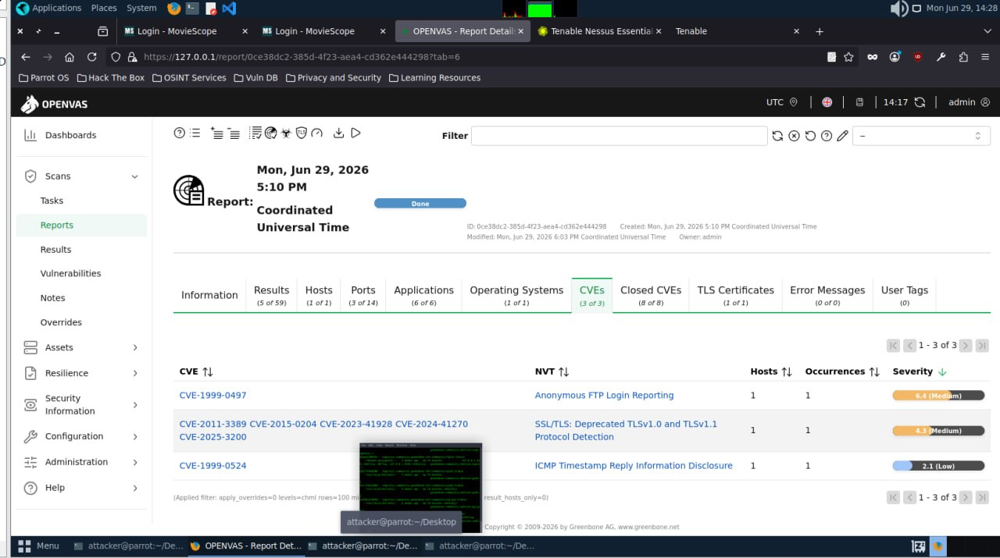

# OpenVAS Vulnerability Scanning Lab

Date: 2026-06-29
Attacker Machine: Parrot OS
Target: 10.10.1.19 (www.goodshopping.com)
Tool: OpenVAS (Greenbone Vulnerability Manager)
Total Results: 59
Environment: VMware isolated lab network

---

## Objective
Perform a comprehensive vulnerability assessment
against a Windows target using OpenVAS to identify
security weaknesses, misconfigurations, and known
CVEs that could be exploited during a penetration
test.

---

## What is OpenVAS?
OpenVAS (Open Vulnerability Assessment System) is
a full-featured vulnerability scanner maintained
by Greenbone Networks. It identifies:
- Known CVEs and their severity
- Service misconfigurations
- Outdated software versions
- Missing security patches
- Network exposure issues

---

## Scan Summary

| Category | Count |
|----------|-------|
| Total Results | 59 |
| Hosts Scanned | 1 |
| Ports Identified | 14 |
| Applications Found | 6 |
| CVEs (Active) | 3 |
| Closed CVEs | 8 |
| TLS Certificates | 1 |

---

## Vulnerabilities Found

### Vulnerability 1 — Anonymous FTP Login
Severity: 6.4 (Medium)
Port: 21/tcp
QoD: 80%
CVE: CVE-1999-0497

Anonymous FTP login is enabled on the target.
Anyone can connect to the FTP server without
credentials and potentially read or write files.

### Vulnerability 2 — DCE/RPC and MSRPC Services
Severity: 5.0 (Medium)
Port: 135/tcp
QoD: 80%

DCE/RPC and MSRPC services are exposed and
enumerable. Attackers can enumerate available
RPC services for further exploitation.

### Vulnerability 3 — FTP Unencrypted Cleartext Login
Severity: 4.8 (Medium)
Port: 21/tcp
QoD: 70%

FTP credentials are transmitted in cleartext
over the network making them vulnerable to
interception via network sniffing attacks.

### Vulnerability 4 — SSL/TLS Deprecated Protocol
Severity: 4.3 (Medium)
Port: 3389/tcp
QoD: 98%
CVEs: CVE-2011-3389, CVE-2015-0204,
         CVE-2023-41928, CVE-2024-41270,
         CVE-2025-3200

TLSv1.0 and TLSv1.1 are deprecated and
vulnerable to multiple known attacks including
BEAST and POODLE. Should be disabled immediately.

### Vulnerability 5 — ICMP Timestamp Reply
Severity: 2.1 (Low)
Port: general/icmp
QoD: 80%
CVE: CVE-1999-0524

ICMP timestamp replies leak system time
information which can assist attackers in
fingerprinting and reconnaissance activities.

---

## Active CVEs Summary

| CVE | Vulnerability | Severity |
|-----|--------------|----------|
| CVE-1999-0497 | Anonymous FTP Login | Medium |
| CVE-2011-3389, CVE-2015-0204, CVE-2023-41928, CVE-2024-41270, CVE-2025-3200 | SSL/TLS Deprecated | Medium |
| CVE-1999-0524 | ICMP Timestamp Disclosure | Low |

---

## Closed CVEs — Critical Findings

All scored 10.0 CRITICAL:

| CVE | Vulnerability |
|-----|--------------|
| CVE-2009-2526 | Microsoft Windows SMB2 Negotiation Protocol RCE |
| CVE-2009-2532 | Microsoft Windows SMB2 Negotiation Protocol RCE |
| CVE-2009-3103 | Microsoft Windows SMB2 Negotiation Protocol RCE |
| CVE-2008-3479 | Microsoft Message Queuing MSMQ RCE |
| CVE-2010-0020 | Microsoft Windows SMB Server NTLM Multiple Vulnerabilities |
| CVE-2010-0021 | Microsoft Windows SMB Server NTLM Multiple Vulnerabilities |
| CVE-2010-0022 | Microsoft Windows SMB Server NTLM Multiple Vulnerabilities |
| CVE-2010-0231 | Microsoft Windows SMB Server NTLM Multiple Vulnerabilities |

---

## Critical Findings Summary

| Finding | Severity | Risk |
|---------|----------|------|
| Anonymous FTP enabled | Medium 6.4 | CRITICAL |
| FTP cleartext credentials | Medium 4.8 | HIGH |
| Deprecated SSL/TLS protocols | Medium 4.3 | HIGH |
| MSMQ RCE vulnerability | Critical 10.0 | CRITICAL |
| SMB2 RCE vulnerabilities | Critical 10.0 | CRITICAL |
| SMB NTLM vulnerabilities | Critical 10.0 | CRITICAL |
| ICMP timestamp disclosure | Low 2.1 | MEDIUM |

---

## Attack Scenarios

### Scenario 1 — Anonymous FTP Access
Attacker connects to FTP anonymously and
reads sensitive files from the server without
any credentials.

### Scenario 2 — SMB2 RCE Exploitation
CVE-2009-2526/2532/3103 allow unauthenticated
remote code execution via SMB2 negotiation.
Exploitable with Metasploit modules.

### Scenario 3 — MSMQ Remote Code Execution
CVE-2008-3479 allows attackers to execute
arbitrary code via malformed MSMQ packets
on port 1801.

### Scenario 4 — Credential Interception
FTP credentials sent in cleartext can be
captured using Wireshark or Responder on
the same network segment.

---

## Lessons Learned

1. A single unpatched service can expose an
   entire server to critical vulnerabilities
2. Anonymous FTP is a critical misconfiguration
   that should never exist in production
3. Deprecated SSL/TLS protocols expose all
   encrypted traffic to decryption attacks
4. SMB vulnerabilities are consistently some
   of the most critical in Windows environments
5. Regular vulnerability scanning is essential
   for maintaining security posture

---

## Defensive Recommendations

- Disable anonymous FTP immediately
- Implement FTPS or SFTP for encrypted transfers
- Disable TLSv1.0 and TLSv1.1 on all services
- Apply all Windows security patches
- Disable MSMQ if not required
- Restrict SMB access to authorised hosts
- Run regular OpenVAS scans to track remediation

---

## Tools Used
- OpenVAS Greenbone Vulnerability Manager
- Parrot Security OS

---

## Next Steps
- Exploit anonymous FTP to access server files
- Attempt SMB2 RCE using Metasploit
- Crack intercepted FTP credentials
- Document remediation recommendations
