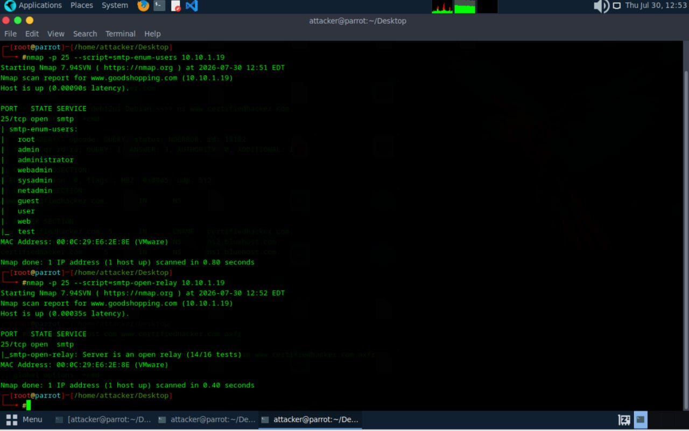

# SMTP Enumeration Lab

Date: 2026-07-30
Attacker Machine: Parrot OS
Target: 10.10.1.19 (www.goodshopping.com)
Tool: Nmap 7.94SVN
Environment: VMware isolated lab network

---

## Objective
Enumerate SMTP service on target to discover valid
usernames and test for open relay misconfiguration
that could be exploited for spam or phishing attacks.

---

## What is SMTP Enumeration?
SMTP (Simple Mail Transfer Protocol) runs on port 25
and can reveal sensitive information including:
- Valid usernames on the system
- Mail server configuration
- Open relay status
- Server software and version

---

## Scan 1 — SMTP User Enumeration

nmap -p 25 --script=smtp-enum-users 10.10.1.19

### Results
PORT     STATE  SERVICE
25/tcp   open   smtp

smtp-enum-users:
- root
- admin
- administrator
- webadmin
- sysadmin
- netadmin
- guest
- user
- web
- test

MAC Address: 00:0C:29:E6:2E:8E (VMware)

### What This Reveals
10 valid system usernames discovered without
any authentication. These usernames can be used
for password brute force, credential stuffing,
social engineering and further exploitation.

---

## Scan 2 — SMTP Open Relay Test

nmap -p 25 --script=smtp-open-relay 10.10.1.19

### Results
PORT    STATE  SERVICE
25/tcp  open   smtp

smtp-open-relay: Server is an open relay (14/16 tests)

MAC Address: 00:0C:29:E6:2E:8E (VMware)

### What This Reveals
Server passed 14 out of 16 open relay tests
confirming it is an OPEN RELAY. This means:
- Anyone can send emails through this server
- Can be abused for spam campaigns
- Can be used to send phishing emails
- Allows email spoofing attacks
- Will get blacklisted by email providers

---

## Critical Findings Summary

| Finding | Detail | Risk |
|---------|--------|------|
| 10 usernames enumerated | root, admin, administrator etc | CRITICAL |
| Open relay confirmed | 14/16 tests passed | CRITICAL |
| SMTP unauthenticated | Port 25 open | HIGH |
| Administrator account exposed | Valid username | HIGH |

---

## Attack Scenarios

### Scenario 1 — Brute Force
Discovered usernames can be targeted with
password brute force using Hydra:
hydra -l admin -P wordlist.txt smtp://10.10.1.19

### Scenario 2 — Phishing via Open Relay
Attacker routes phishing emails through
this server making them appear legitimate
bypassing spam filters and targeting
employees or customers.

### Scenario 3 — Spam Campaign
Open relay exploited to send mass spam
emails damaging the organisation email
reputation and causing blacklisting.

---

## Lessons Learned

1. SMTP user enumeration reveals valid accounts
   without any authentication required
2. Open relay is one of the most dangerous mail
   server misconfigurations in existence
3. Default accounts like guest, test, web should
   never exist on production systems
4. SMTP should always require authentication
   before accepting mail for relay

---

## Defensive Recommendations

- Disable SMTP open relay immediately
- Implement SMTP authentication (SMTP AUTH)
- Remove default accounts (guest, test, web)
- Implement rate limiting on SMTP connections
- Enable SMTP logging and monitoring
- Use SPF, DKIM, and DMARC records
- Block port 25 from external access

---

## Tools Used
- Nmap 7.94SVN
- NSE Scripts: smtp-enum-users, smtp-open-relay
- Parrot Security OS

---

## Next Steps
- Brute force discovered usernames with Hydra
- Attempt to send spoofed email via open relay
- Enumerate other services on same target
