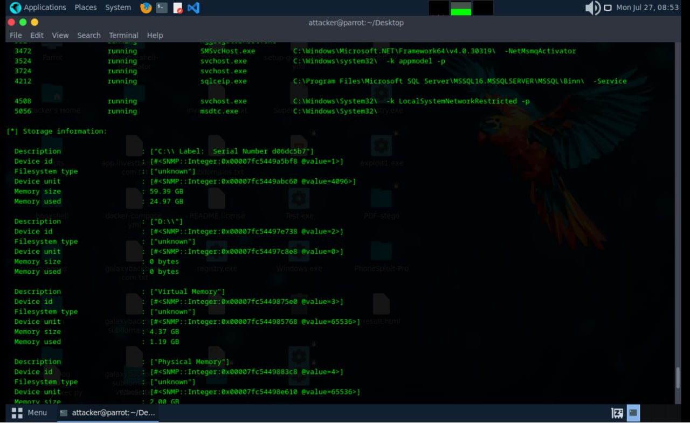
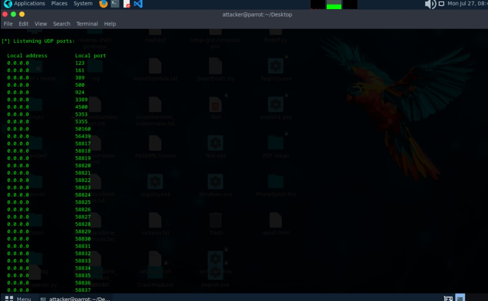
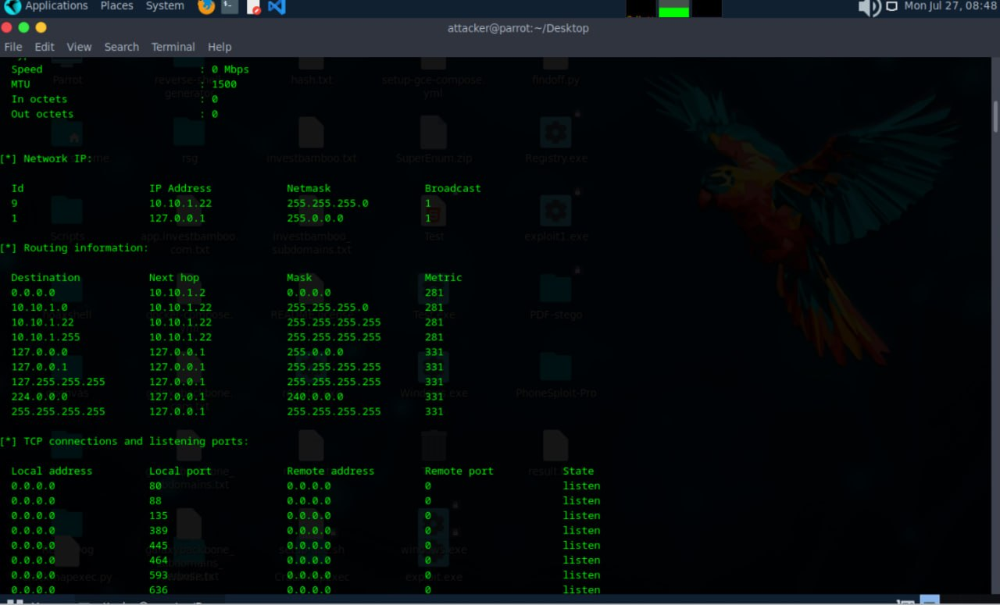
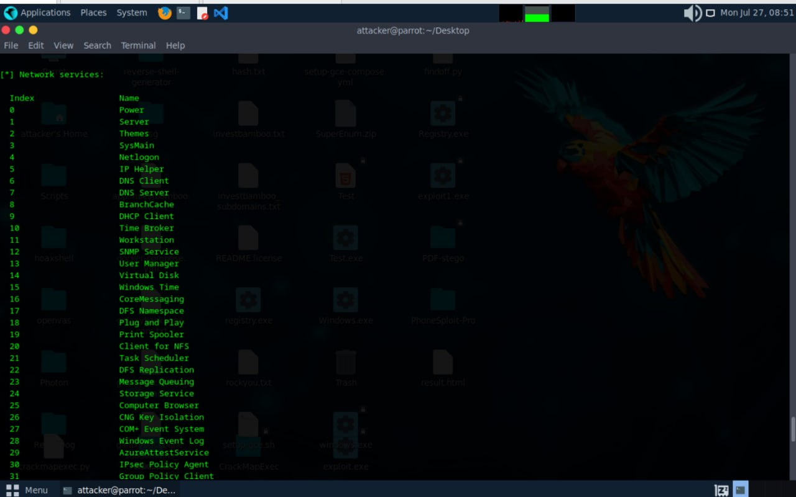
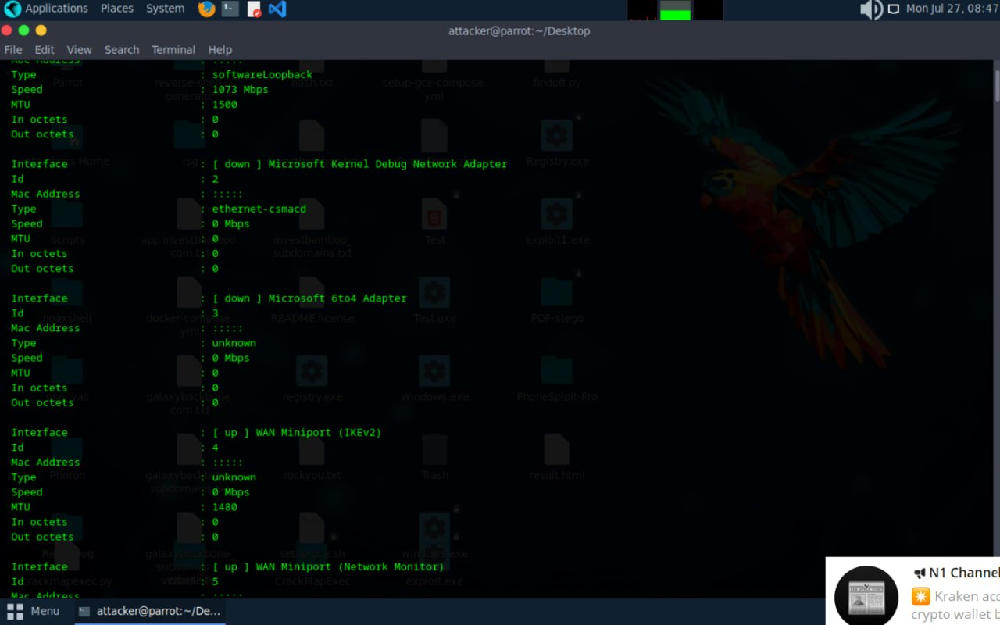
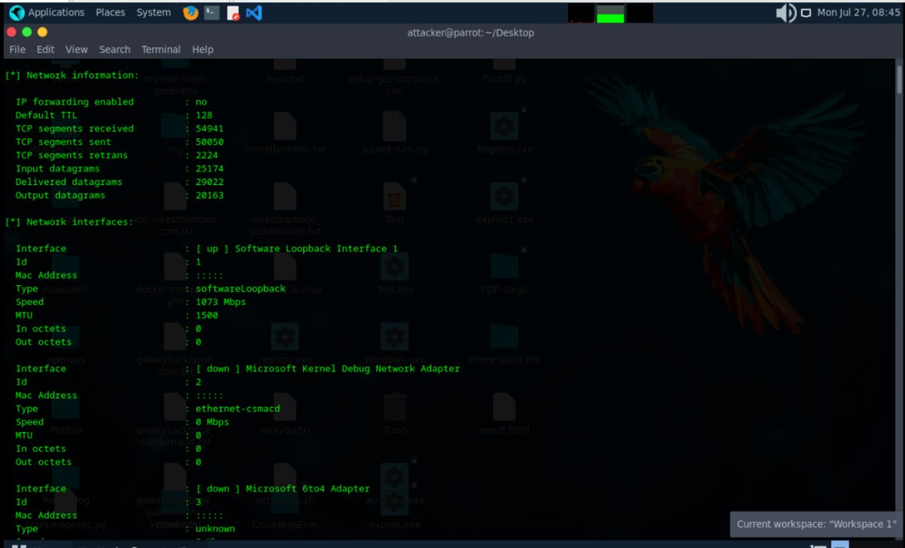
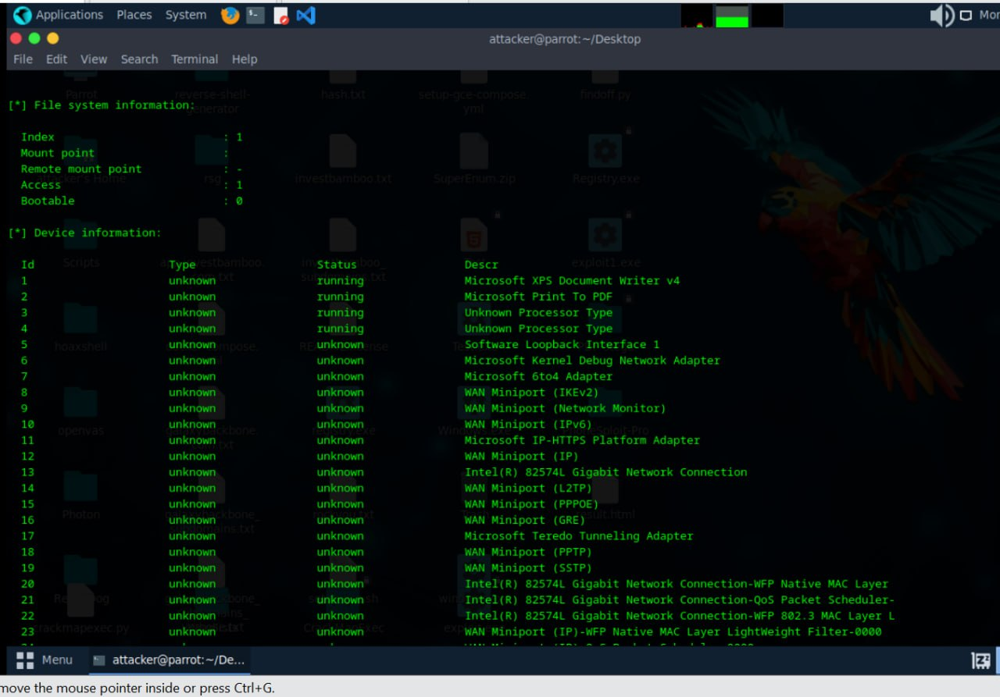
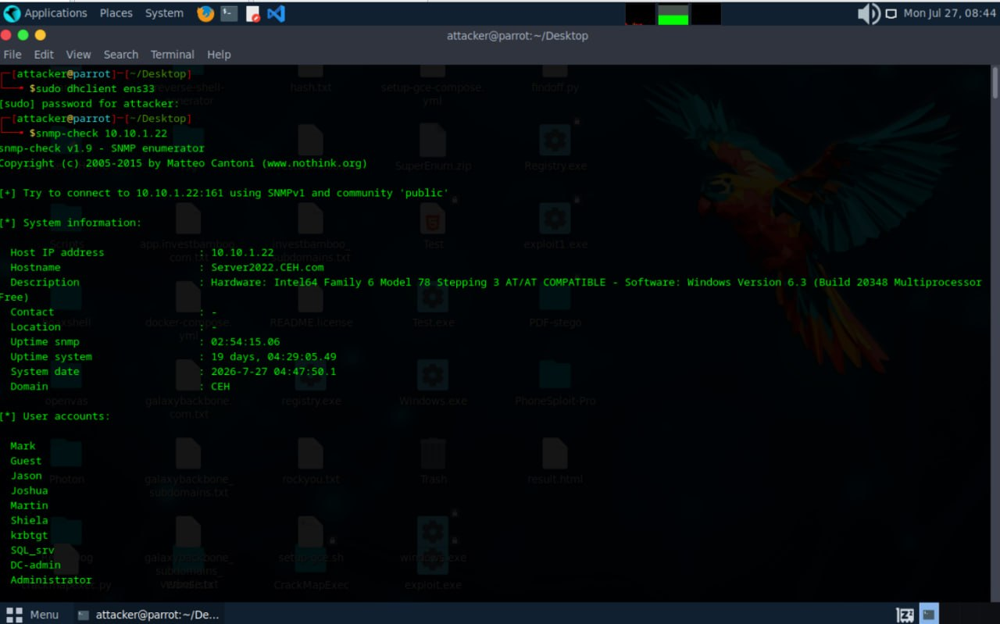
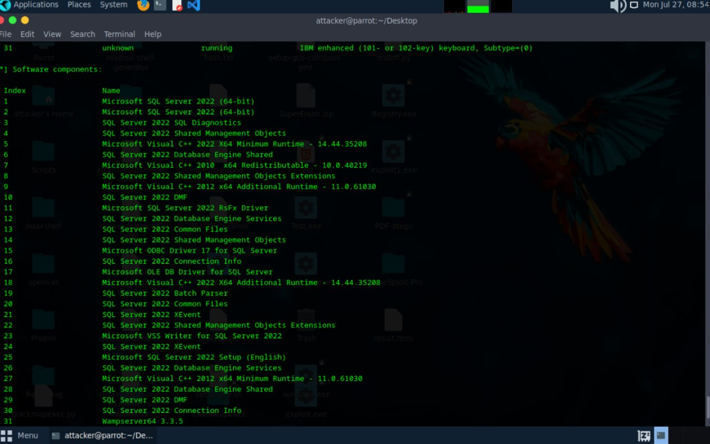
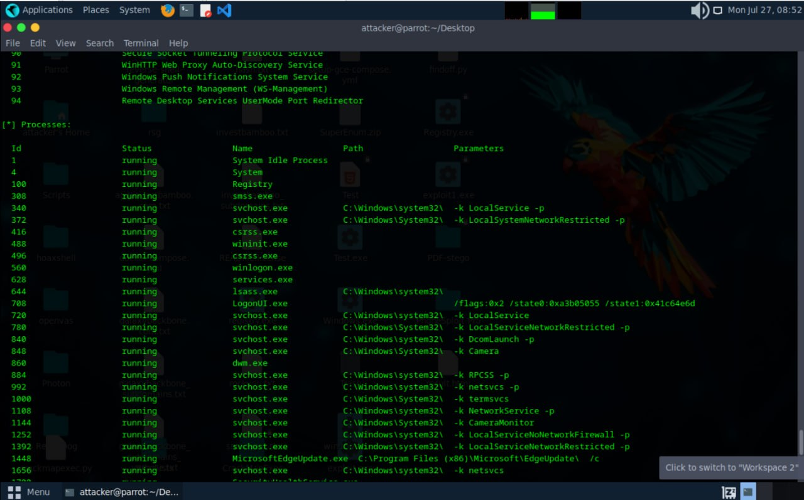

# SNMP Enumeration Lab

Date: 2026-07-27
Attacker Machine: Parrot OS
Target: 10.10.1.22 (Server2022.CEH.com)
Tool: snmp-check v1.9
Community String: public
Environment: VMware isolated lab network

---

## Objective
Perform SNMP enumeration against a Windows Server
2022 Domain Controller to extract system information,
user accounts, network configuration, running
processes, installed software and storage details
using the default community string.

---

## What is SNMP Enumeration?
SNMP (Simple Network Management Protocol) runs on
UDP port 161 and is used for network device
management. With the default community string
'public' an attacker can extract:
- System information and hostname
- User accounts
- Network interfaces and routing tables
- Running processes
- Installed software
- Storage information
- TCP/UDP connections

---

## Command Used

snmp-check 10.10.1.22

Connected to 10.10.1.22:161 using SNMPv1
Community string: public

---

## Finding 1 — System Information

Host IP address: 10.10.1.22
Hostname: Server2022.CEH.com
Description: Hardware Intel64 Family 6 Model 78
             Windows Version 6.3 Build 20348
             Multiprocessor Free
Contact: -
Location: -
Uptime snmp: 02:54:15.06
Uptime system: 19 days 04:29:05.49
System date: 2026-07-27 04:47:50.1
Domain: CEH

---

## Finding 2 — User Accounts Enumerated

Mark
Guest
Jason
Joshua
Martin
Shiela
krbtgt
SQL_srv
DC-admin
Administrator

---

## Finding 3 — Network Information

IP forwarding enabled: no
Default TTL: 128
TCP segments received: 54941
TCP segments sent: 50050

Network IP:
ID: 9  IP: 10.10.1.22  Netmask: 255.255.255.0
ID: 1  IP: 127.0.0.1   Netmask: 255.0.0.0

---

## Finding 4 — Network Interfaces

Interface: Software Loopback Interface 1
Speed: 1073 Mbps  MTU: 1500

Interface: Microsoft Kernel Debug Network Adapter
Type: ethernet-csmacd  Speed: 0 Mbps

Interface: WAN Miniport IKEv2 — up
Interface: WAN Miniport Network Monitor — up

---

## Finding 5 — Routing Information

Destination    Next Hop      Mask              Metric
0.0.0.0        10.10.1.2     0.0.0.0           281
10.10.1.0      10.10.1.22    255.255.255.0     281
10.10.1.22     10.10.1.22    255.255.255.255   281
10.10.1.255    10.10.1.22    255.255.255.255   281
127.0.0.0      127.0.0.1     255.0.0.0         331

---

## Finding 6 — TCP Connections and Listening Ports

Port 80   — HTTP
Port 88   — Kerberos
Port 135  — MSRPC
Port 389  — LDAP
Port 445  — SMB
Port 464  — kpasswd
Port 593  — HTTP RPC
Port 636  — LDAPS
Port 3389 — RDP

---

## Finding 7 — Listening UDP Ports

Port 123  — NTP
Port 161  — SNMP
Port 389  — LDAP
Port 500  — IKE
Port 3389 — RDP
Port 4500 — IKE NAT

---

## Finding 8 — Running Processes

System Idle Process
System
Registry
smss.exe
svchost.exe — multiple instances
csrss.exe
wininit.exe
winlogon.exe
services.exe
lsass.exe — C:\Windows\system32\
dwm.exe
sqlceip.exe — SQL Server
msdtc.exe

---

## Finding 9 — Storage Information

C:\ Drive:
Memory size: 59.39 GB
Memory used: 24.97 GB

D:\ Drive:
Memory size: 0 bytes

Virtual Memory:
Memory size: 4.37 GB
Memory used: 1.19 GB

Physical Memory:
Memory size: 2.00 GB

---

## Finding 10 — Installed Software

Microsoft SQL Server 2022 (64-bit)
SQL Server 2022 SQL Diagnostics
SQL Server 2022 Shared Management Objects
Microsoft Visual C++ 2022 X64
SQL Server 2022 Database Engine Shared
WampServer 3.3.5
Microsoft ODBC Driver 17 for SQL Server
Microsoft OLE DB Driver for SQL Server

---

## Critical Findings Summary

| Finding | Detail | Risk |
|---------|--------|------|
| Default community string | public accepted | CRITICAL |
| 10 user accounts exposed | Including Administrator | CRITICAL |
| SQL Server 2022 installed | Attack surface identified | HIGH |
| WampServer detected | Web server running | HIGH |
| Full routing table exposed | Network map revealed | HIGH |
| Physical memory revealed | 2GB RAM | MEDIUM |
| Storage details exposed | 59GB C: drive | MEDIUM |
| lsass.exe process visible | Credential attack target | CRITICAL |
| RDP confirmed on 3389 | Remote access exposed | HIGH |
| krbtgt account visible | Kerberoasting target | CRITICAL |

---

## Attack Scenarios

### Scenario 1 — Credential Attacks
10 valid usernames discovered including
Administrator and krbtgt — prime targets
for password spraying and Kerberoasting.

### Scenario 2 — SQL Server Exploitation
Microsoft SQL Server 2022 confirmed running.
Combined with SQL_srv account discovered
enables targeted SQL Server attacks.

### Scenario 3 — Process Injection
lsass.exe confirmed running — target for
credential dumping using Mimikatz after
gaining initial access.

---

## Lessons Learned

1. Default SNMP community string 'public'
   exposes complete system information
2. SNMP reveals more than any other single
   enumeration technique
3. SQL Server installation combined with
   service account enables targeted attacks
4. Always change default community strings
   and restrict SNMP access

---

## Defensive Recommendations

- Change default community strings immediately
- Use SNMPv3 with authentication and encryption
- Restrict SNMP access to authorised hosts only
- Block UDP port 161 at the perimeter firewall
- Implement SNMP monitoring for anomalies
- Disable SNMP if not required

---

## Tools Used
- snmp-check v1.9
- Parrot Security OS

---

## Next Steps
- Exploit SQL Server using discovered credentials
- Attempt Kerberoasting against krbtgt and SQL_srv
- Use process list to plan post-exploitation
- Target lsass.exe for credential dumping

